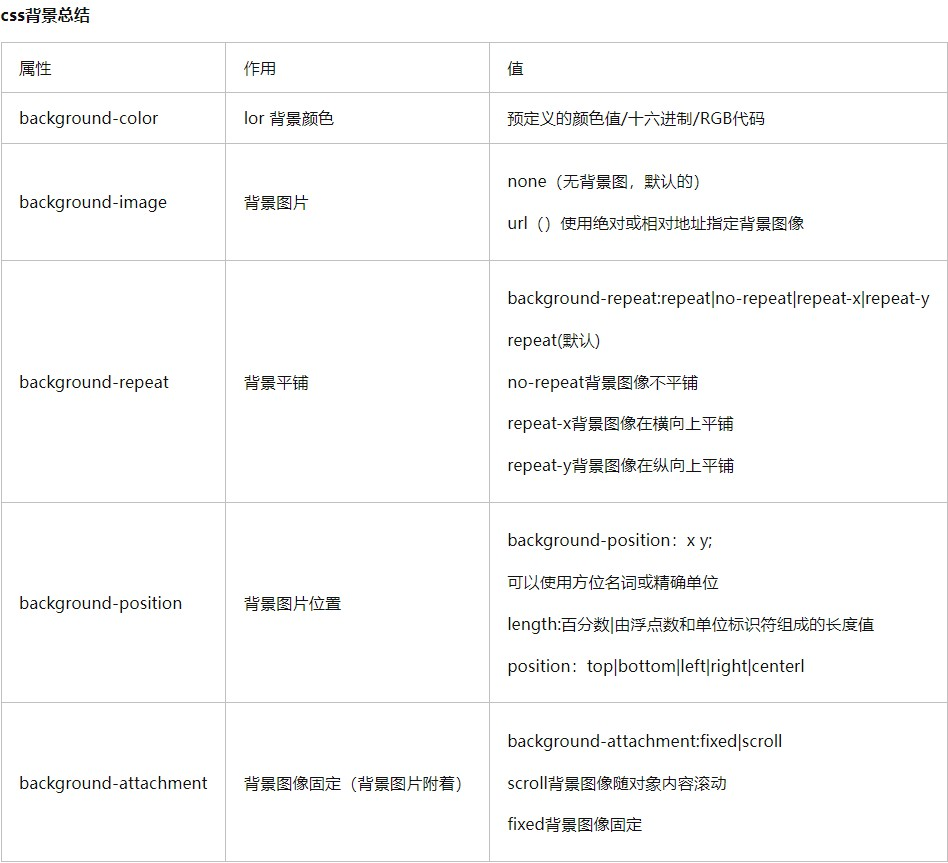

# 人力资源项目介绍

## 1.项目介绍
### 1.1 项目架构和解决方案

### 1.2 课程安排


### 1.3 课程具备能力


### 1.4 课程地址

- 完整项目演示地址：  [element-admin](https://panjiachen.gitee.io/vue-element-admin/#/login)    
- 部分项目演示地址：  [vue-admin-template](https://panjiachen.gitee.io/vue-admin-template/#/login)
- vue-element-admin文档地址：[链接](https://panjiachen.gitee.io/vue-element-admin-site/zh/)
- 课堂项目依赖模板：  [码云仓库地址](https://gitee.com/panjiachen/vue-admin-template)
- 人力资源项目演示地址：  [链接](https://heimahr.itheima.net/login)


## 2.拉取项目基础代码

- 拉取命令
```bash
$ git clone https://gitee.com/errlei/renzi_admin_template.git rz_92
```

- 扩展知识点
  + 常见的终端 --- 黑窗口种类

- 安装完整依赖
```bash
安装依赖之前，先要配好自己电脑的一些环境变量
链接：https://pan.baidu.com/s/1FOEVm8vrUOdQLdrzl57JaQ?pwd=y7ks 
提取码：y7ks 
复制这段内容后打开百度网盘手机App，操作更方便哦

我电脑的环境 node 16.14.1   .npmrc  .yarnrc

$ npm install # npm
$ yarn  # yarn
```

- npm/yarn安装失败后怎么解决
  ```
  1. 删除node_modules
  2. 删除package-lock.json 或者 yarn.lock
  3. 清除缓存 npm cache clean --force
              yarn cache clean
  4. 查看自己的家目录下面的 .npmrc 或者 .yarnrc 文件, 然后再install依赖
  ```

- 启动命令在package.json中查看
```bash
$ npm run dev
$ yarn dev
```

- 需要检查VsCode本身的插件ESLint 和 Vutur


## 3.项目目录和src目录

- 项目目录
```bash
├── .git               # 源代码目录
├── build              # 项目打包以后的文件 npm run build
├── mock               # 假数据的目录
├── node_modules       # 下载安装的依赖文件
├── public             # 静态资源的文件夹
├── src                # 工作里面的核心业务代码
├── tests              # 单元测试的文件
├── .editorconfig      # 跨不同的编辑器保存风格统一的文件
├── .env.xxxx          # 不同的环境变量读取的文件
├── .eslintignore      # eslint格式化的时候 忽略的文件
├── .eslintrc.js       # eslint读取的配置文件
├── .gitignore         # git管理项目的时候，哪些不需要进行管理
├── babel.config.js    # babel配置文件
├── .travis.yml        # (不)持续集成服务的配置文件，push代码的时候，自动构建和检测
├── jest.config.js     # (不)单元测试的配置文件
├── jsconfig.json      # (不)提升js项目的开发体验
├── LICENSE            # 许可证
├── package.json       # 项目的启动入口
├── postcss.config.js  # postcss后置css处理器的配置文件
├── README.md          # 项目的说明文档
├── vue.config.js      # vue项目的配置文件，底层是webpack
├── yarn.lock          # 安装依赖的时候，锁定版本号，yarn安装
├── package-lock.json  # 安装依赖的时候，锁定版本号，npm安装
```

了解周边-增长见识
+ 常见的编辑器-editorconfig配置文件
  + https://editorconfig.org/
+ 单元测试jest
  + http://github.yanhaixiang.com/jest-tutorial/intro/why-test
+ 项目开发环境，生产环境
+ lock文件与^和~的区别
  + https://juejin.cn/post/7213298252535038010
+ vue.config.js文件与webpack的关系
  + https://cli.vuejs.org/zh/guide/webpack.html#%E4%BB%8B%E7%BB%8D
+ postcss 后置css处理器
  + https://github.com/ecmadao/Coding-Guide/blob/master/Notes/CSS/PostCSS%E9%85%8D%E7%BD%AE%E6%8C%87%E5%8C%97.md

- src业务目录
```bash
├── src                        # 源代码目录
│   ├── api                    # 所有请求
│   ├── assets                 # 主题 字体等静态资源
│   ├── components             # 全局公用组件
│   ├── icons                  # 项目所有 svg icons
│   ├── layout                 # 全局 layout
│   ├── router                 # 路由
│   ├── store                  # 全局 store管理
│   ├── styles                 # 全局样式
│   ├── utils                  # 全局公用方法
│   ├── views                  # views 所有页面
│   ├── App.vue                # 入口页面
│   ├── main.js                # 入口文件 加载组件 初始化等
│   └── permission.js          # 权限管理
│   └── settings.js            # 配置文件

```
## 4.入口文件与App.vue根组件解析

- vue-tools插件使用
  - 问题：怎么样通过页面在vscode里面找到对应的组件


- layout布局


## 5.基础设置settings.js和导航守卫permission.js


settings.js导出网站基础配置，包括：网站标题、固定header、显示logo
permission.js(权限)，主要负责路由导航守卫

## 6.Vuex的结构

- 模板中的结构


注意：人资资源项目主要针对**用户模块user **进行改造和重写

- Vuex的设计思想

1.页面交互状态（折叠侧边栏-固定头部）

2.使用全局状态Vuex根据功能拆分成不同的模块（modules）

3.进行状态管理通过getters建立对于模块中属性的快捷访问


## 7.使用模板中的Icon图标

- SVG预览插件：Svg Preview
  - https://www.runoob.com/svg/svg-tutorial.html 矢量图形

- src/icons/svg目录下的图标都可以使用


- 图标文件名直接设置为svg-icon组件的iconClass属性


## 9.导入样式资源并使用git管理

+ 什么是git
+ git 与 github gitlab gitee区别

- 将教学资源中的初始化**图片-样式-svg **拷贝到src目录下


> 因为项目是从github上拉取下来的，所以git记录了之前模版的信息，所以删除需要建立git

- 删除原有的.git文件
- 初始化仓库
```bash
$ git init # 初始化仓库
```

- 添加到暂存区
```bash
$ git add . # 添加到暂存区
```

- 提交本地仓库
```bash
$ git commit -m "初始化人力资源项目" # 提交本地仓库
```
> 接下来，同学们需要在gitee上新建一个自己的远程仓库，然后将本地的仓库推送到远程仓库托管

- 本地仓库配置远程仓库地址
```bash
$ git remote add origin <你的远程仓库地址>  # 本地仓库配置远程仓库地址
```

- 推送到远程仓库
```bash
$ git push -u origin master # 推送到远程仓库
```
## 10.登录页的结构和表单

**background复合属性**
```
background: background-color background-image background-repeat background-attachment background-position/background-size
background: 背景色 图片地址 是否重复 是否固定 定位/图片尺寸

示例
background: #fff url(../assets/images/login_bg.png) no-repeat fixed center/cover;

如果记忆比较困惑就写个背景图片即可，剩下的复合属性，单独去写
background: url(../assets/images/login_bg.png) no-repeat
background-position: 0% 0%(默认值，等同于left top,也可以设置为10% 30px) 精灵图就是这个属性的使用
background-size: auto/cover(会裁剪掉)/contain(会有空隙，占不满盒子)
```



> 接下来需要实现登录页的表单结构和表单内容


- 拷贝登录页的基本结构布局-代码位置(**src/views/login/index.vue)**
```vue
<template>
  <div class="login-container">
    <div class="logo" />
    <div class="form">
      <h1>登录</h1>
      <el-card shadow="never" class="login-card">
        <!--登录表单-->
      </el-card>
    </div>
  </div>
</template>
<script>
export default {
  name : "Login"
}
</script>
<style lang="scss">
.login-container {
  display: flex;
  align-items: stretch;
  height: 100vh;
  .logo {
    flex: 3;
    background: rgba(38, 72, 176) url(../../assets/common/login_back.png)
      no-repeat center / cover;
    border-top-right-radius: 60px;
    display: flex;
    flex-direction: column;
    align-items: flex-end;
    justify-content: center;
    padding: 0 100px;
    .icon {
      background: url(../../assets/common/logo.png) no-repeat 70px center /
        contain;
      width: 300px;
      height: 50px;
      margin-bottom: 50px;
    }
    p {
      color: #fff;
      font-size: 18px;
      margin-top: 20px;
      width: 300px;
      text-align: center;
    }
  }
  .form {
    flex: 2;
    display: flex;
    flex-direction: column;
    justify-content: center;
    padding-left: 176px;
    .el-card {
      border: none;
      padding: 0;
    }
    h1 {
      padding-left: 20px;
      font-size: 24px;
    }
    .el-input {
      width: 350px;
      height: 44px;
      .el-input__inner {
        background: #f4f5fb;
      }
    }
    .el-checkbox {
      color:#606266;
    }
  }
}
</style>

```

- 实现登录表单的结构
```html
<div class="form">
  <h1>登录</h1>
  <el-card shadow="never" class="login-card">
    <!--登录表单-->
    <!-- el-form > el-form-item > el-input -->
    <el-form>
      <el-form-item>
        <el-input placeholder="请输入手机号" />
      </el-form-item>
      <el-form-item>
        <el-input placeholder="请输入密码" />
      </el-form-item>
      <el-form-item>
        <el-checkbox>
          用户平台使用协议
        </el-checkbox>
      </el-form-item>
      <el-form-item>
        <el-button style="width:350px" type="primary">登录</el-button>
   </el-form-item>
</el-form>
```

- 提交代码
## 11.登录表单校验-实现

1. 定义数据和校验规则

- 页面字段的来源**后端接口文档**
  - 查找对应的接口，查看参数，多个参数用一个对象作为数据结构，包裹起来
  - [接口文档](https://apifox.com/apidoc/shared-e2644216-aad4-4529-a630-78f0631ab076/api-45197376)
- 校验规则
  - 手机号必填 + 正则校验
  - 密码必填 + 6-16位

```vue
export default {
  name: 'Login'
  data() {
    return {
      loginForm: {
        mobile: '',
        password: '',
        isAgree: false
      },
      loginRules: {
        mobile: [{
          required: true,
          message: '请输入手机号',
          trigger: 'blur'
        }, {
          pattern: /^1[3-9]\d{9}$/,
          message: '手机号格式不正确',
          trigger: 'blur'

        }],
        password: [{
          required: true,
          message: '请输入密码',
          trigger: 'blur'
        }, {
          min: 6,
          max: 16,
          message: '密码长度应该为6-16位之间',
          trigger: 'blur'

        }],
        // required只能检查 null "" undefined
        isAgree: [{
          validator: (rule, value, callback) => {
            // rule规则
            // value检查的数据 true/false
            // callback 函数 执行这个函数
            // 成功执行callback 失败也执行callback(错误对象 new Error(错误信息))
            value ? callback() : callback(new Error('没有勾选用户平台协议'))
          }
        }]
      }
    }
  },
  methods: {
    login() {
      this.$refs.form.validate((isOK) => {
        if (isOK) {
          alert('校验通过')
        }
      })
    }
  }
}
</script>
```

1. 绑定组件的对应属性
```vue
 <el-form ref="form" :model="loginForm" :rules="loginRules">
      <el-form-item prop="mobile">
            <el-input v-model="loginForm.mobile" placeholder="请输入手机号" />
      </el-form-item>
      <el-form-item prop="password">
          <el-input v-model="loginForm.password" show-password placeholder="请输入密码" />
      </el-form-item>
      <el-form-item prop="isAgree">
          <el-checkbox v-model="loginForm.isAgree">
              用户平台使用协议
          </el-checkbox>
      </el-form-item>
      <el-form-item>
          <el-button style="width:350px" type="primary" @click="login">登录</el-button>
      </el-form-item>
</el-form>
```
