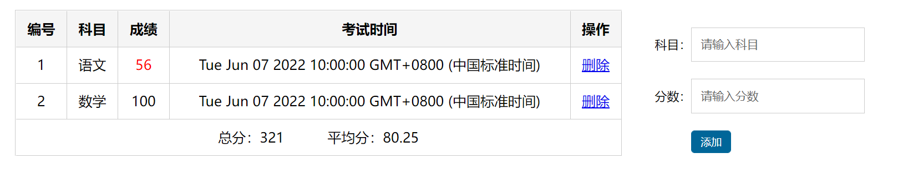
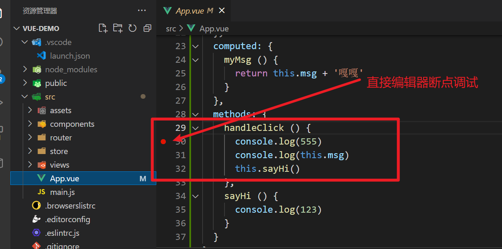
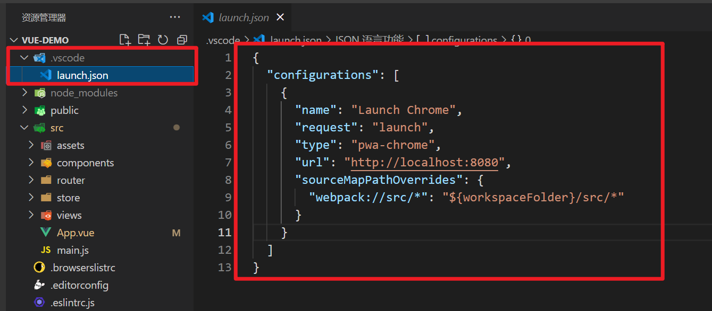
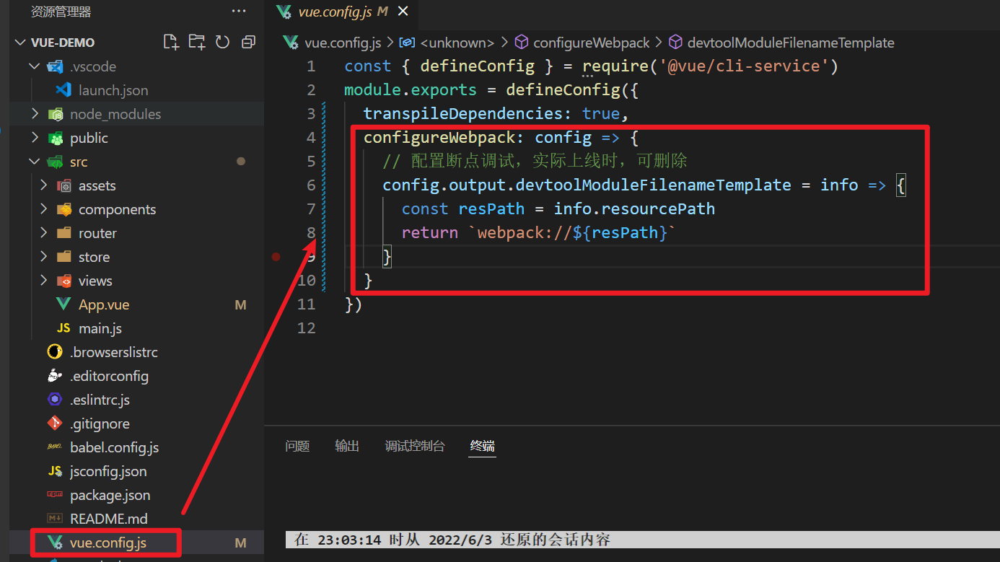
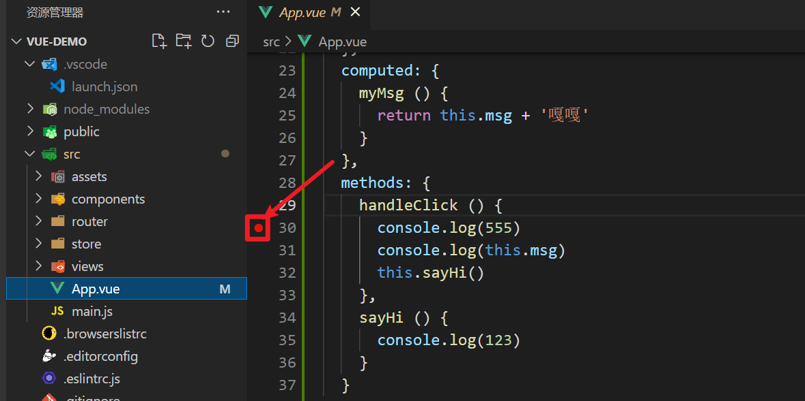
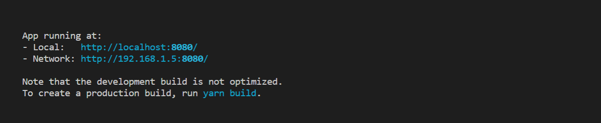
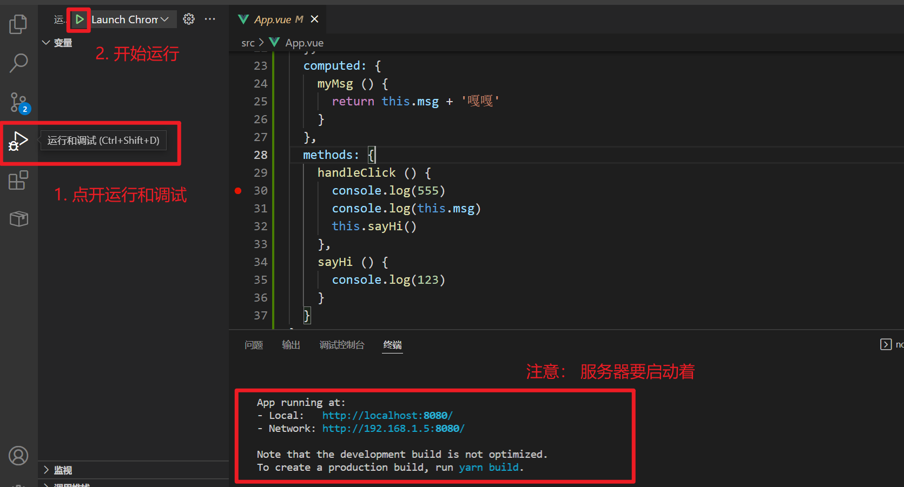
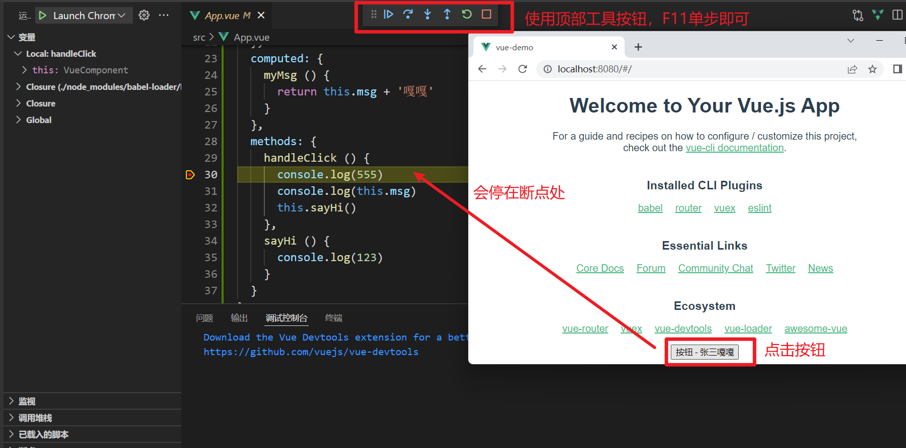

# vue指令（下）

## v-for 

### 基本使用

 v-for 作用: 遍历对象和数组

1. 遍历数组 (常用)

```jsx
v-for="item in 数组名"  item每一项
v-for="(item, index) in 数组名"  item每一项 index下标

注意：item和index不是定死的，可以是任意的名字，但是需要注意 第一项是值  第二项是下标
```

2. 遍历对象 (一般不用)

```jsx
<!--
  v-for也可以遍历对象（不常用）
  v-for="(值, 键) in 对象"
-->
<ul>
  <li v-for="value in user" :key="value">{{value}}</li>
</ul>
<ul>
  <li v-for="(value, key) in user" :key="key">{{value}} ---{{key}}</li>
</ul>
```

3. 遍历数字

```jsx
<!-- 
  遍历数字
  语法： v-for="(item, index) in 数字"
  作用：遍历具体的次数 item从1开始  index下标从0开始的
-->
<ul>
  <li v-for="(item, index) in 10" :key="item">{{item}} ---{{index}}</li>
</ul>
```

### 虚拟DOM 和 diff算法

**vue就地复用策略：**Vue会尽可能的就地（同层级，同位置），对比虚拟dom，复用旧dom结构，进行差异化更新。

**虚拟dom**: 本质就是一个个保存节点信息, 属性和内容的 描述真实dom的 JS 对象

**diff算法：**

- 策略1：

  先同层级根元素比较，如果根元素变化，那么不考虑复用，整个dom树删除重建

  先同层级根元素比较，如果根元素不变，对比出属性的变化更新，并考虑往下递归复用。

- 策略2：

  对比同级兄弟元素时，默认按照**下标**进行对比复用。

  对比同级兄弟元素时，如果指定了 key，就会 **按照相同 key 的元素** 来进行对比。

### v-for 的key的说明

1. 设置 和 不设置 key 有什么区别？

   - 不设置 key， 默认同级兄弟元素按照下标进行比较。
   - 设置了key，按照相同key的新旧元素比较。

2. key值要求是?

   - 字符串或者数值，唯一不重复
   - 有 id 用 id,  有唯一值用唯一值，实在都没有，才用索引

3. key的好处?

   key的作用：提高虚拟DOM的对比复用性能

以后：只要是写到列表渲染，都推荐加上 key 属性。且 key 推荐是设置成 id， 实在没有，就设置成 index


## 样式处理

###  v-bind 对于class的增强

v-bind 对于类名操作的增强, 注意点, :class 不会影响到原来的 class 属性

:class="对象/数组"

```jsx
<template>
  <div>
    <!-- 
      v-bind： 作用：设置动态属性
      v-bind针对 class和style 进行增强
      允许使用对象或者数组
        对象：如果键值对的值为true，那么就有这个，否则没有这个类
        数组：数组中所有的类都会添加到盒子上
    -->
    <!-- <div class="box" :class="isRed ? 'red': ''">123</div> -->
    <!-- <div class="box" :class="{red: isRed, pink: isPink}">123</div> -->
    <div class="box" :class="arr">123</div>
  </div>
</template>
```

### v-bind对于style 的增强

```jsx
<template>
  <div>
    <!-- 
      :style也可以使用对象或者数组
     -->
    <div class="box" :style="[styleObj1, styleObj2]">123</div>
  </div>
</template>
```


# 成绩案例



## 基本结构与样式

```jsx
<template>
  <div class="score-case">
    <div class="table">
      <table>
        <thead>
          <tr>
            <th>编号</th>
            <th>科目</th>
            <th>成绩</th>
            <th>考试时间</th>
            <th>操作</th>
          </tr>
        </thead>
        <tbody>
          <tr >
            <td>1</td>
            <td>语文</td>
            <td class="red">56</td>
            <td>Tue Jun 07 2022 10:00:00 GMT+0800 (中国标准时间)</td>
            <td><a href="#">删除</a></td>
          </tr>
          <tr >
            <td>2</td>
            <td>数学</td>
            <td>100</td>
            <td>Tue Jun 07 2022 10:00:00 GMT+0800 (中国标准时间)</td>
            <td><a href="#">删除</a></td>
          </tr>
        </tbody>
        <!-- <tbody >
          <tr>
            <td colspan="5">
              <span class="none">暂无数据</span>
            </td>
          </tr>
        </tbody> -->
        <tfoot>
          <tr>
            <td colspan="5">
              <span>总分：321</span>
              <span style="margin-left:50px">平均分：80.25</span>
            </td>
          </tr>
        </tfoot>
      </table>
    </div>
    <div class="form">
      <div class="form-item">
        <div class="label">科目：</div>
        <div class="input">
          <input type="text" placeholder="请输入科目" />
        </div>
      </div>
      <div class="form-item">
        <div class="label">分数：</div>
        <div class="input">
          <input type="text" placeholder="请输入分数" />
        </div>
      </div>
      <div class="form-item">
        <div class="label"></div>
        <div class="input">
          <button class="submit" >添加</button>
        </div>
      </div>
    </div>
  </div>
</template>

<script>
export default {
  name: 'ScoreCase',
  data () {
    return {
      list: [
        {id: 15, subject: '语文', score: 89, date: new Date('2022/06/07 10:00:00')},
        {id: 27, subject: '数学', score: 100, date: new Date('2022/06/07 15:00:00')},
        {id: 32, subject: '英语', score: 56, date: new Date('2022/06/08 10:00:00')},
        {id: 41, subject: '物理', score: 76, date: new Date('2022/06/08 10:00:00')}
      ],
      subject: '',
      score: ''
    }
  }
};
</script>

<style lang="less">
.score-case {
  width: 1000px;
  margin: 50px auto;
  display: flex;
  .table {
    flex: 4;
    table {
      width: 100%;
      border-spacing: 0;
      border-top: 1px solid #ccc;
      border-left: 1px solid #ccc;
      th {
        background: #f5f5f5;
      }
      tr:hover td {
        background: #f5f5f5;
      }
      td,
      th {
        border-bottom: 1px solid #ccc;
        border-right: 1px solid #ccc;
        text-align: center;
        padding: 10px;
        &.red {
          color: red;
        }
      }
    }
    .none {
      height: 100px;
      line-height: 100px;
      color: #999;
    }
  }
  .form {
    flex: 1;
    padding: 20px;
    .form-item {
      display: flex;
      margin-bottom: 20px;
      align-items: center;
    }
    .form-item .label {
      width: 60px;
      text-align: right;
      font-size: 14px;
    }
    .form-item .input {
      flex: 1;
    }
    .form-item input,
    .form-item select {
      appearance: none;
      outline: none;
      border: 1px solid #ccc;
      width: 200px;
      height: 40px;
      box-sizing: border-box;
      padding: 10px;
      color: #666;
    }
    .form-item input::placeholder {
      color: #666;
    }
    .form-item .cancel,
    .form-item .submit {
      appearance: none;
      outline: none;
      border: 1px solid #ccc;
      border-radius: 4px;
      padding: 4px 10px;
      margin-right: 10px;
      font-size: 12px;
      background: #ccc;
    }
    .form-item .submit {
      border-color: #069;
      background: #069;
      color: #fff;
    }
  }
}
</style>
```

## 基本渲染

1. v-for 渲染结构
2. v-bind:class 控制样式

```jsx
<tbody>
  <tr v-for="(item, index) in list" :key="item.id">
    <td>{{ index + 1 }}</td>
    <td>{{ item.subject }}</td>
    <td :class="{ red: item.score < 60 }">{{ item.score }}</td>
    <td>{{ item.date }}</td>
    <td><a @click.prevent="del(item.id)" href="#">删除</a></td>
  </tr>
</tbody>
```


## 删除

删除思路：
1. 注册点击事件，传递参数，阻止默认行为
2. 在method中提供对应函数
3. 根据id删除对应项
3. 控制 tbody 展示

```jsx
<tbody v-if="list.length">
  <tr v-for="(item, index) in list" :key="item.id">
    <td>{{ index + 1 }}</td>
    <td>{{ item.subject }}</td>
    <td :class="{ red: item.score < 60 }">{{ item.score }}</td>
    <td>{{ item.date }}</td>
    <td><a @click.prevent="del(item.id)" href="#">删除</a></td>
  </tr>
</tbody>
<tbody v-else>
  <tr>
    <td colspan="5">
      <span class="none">暂无数据</span>
    </td>
  </tr>
</tbody>


methods: {
  del (id) {
    this.list = this.list.filter(item=>item.id !== id)
  } 
}
```


## 新增

添加思路：
1. 获取科目 和 分数
2. 给添加按钮注册点击事件
3. 给list数组添加一个对象
4. 重置表单数据

```jsx
<div class="form">
  <div class="form-item">
    <div class="label">科目：</div>
    <div class="input">
      <input v-model.trim="subject" type="text" placeholder="请输入科目" />
    </div>
  </div>
  <div class="form-item">
    <div class="label">分数：</div>
    <div class="input">
      <input v-model.number="score" type="text" placeholder="请输入分数" />
    </div>
  </div>
  <div class="form-item">
    <div class="label"></div>
    <div class="input">
      <button class="submit" @click="submit">添加</button>
    </div>
  </div>
</div>

methods: {
  submit () {
    if (this.subject && (this.score >= 0 && this.score <= 100)) {
      // 提交
      this.list.push({
        id: this.list.length ? this.list.length + 1 : 0,
        subject: this.subject,
        score: this.score,
        date: new Date()
      })
      this.subject = ''
      this.score = ''
    } else {
      alert('输入内容不正确')
    }
  },
      
  ...
}
```

## 处理日期格式

+ 安装moment

```jsx
yarn add moment
```

+ 引入moment 

```jsx
import moment from 'moment'
```

+ 定义格式化时间的函数

```jsx
methods: {
  	// 格式化时间
    formatDate(input) {
        return moment(input).format('YYYY-MM-DD HH:mm:ss')
    }
}
```

+ 页面中格式化使用

```jsx
<td>{{ formatDate(item.date) }}</td>
```


# 计算属性

## 基本使用

需求：翻转字符串案例

> 计算属性是一个属性，写法上是一个函数，这个函数的返回值就是计算属性最终的值。

> 1. 计算属性必须定义在 computed 节点中

> 2. 计算属性必须是一个 function,计算属性必须有返回值

> 3. 计算属性不能被当作方法调用,当成属性来用

定义计算属性

```jsx
// 组件的数据： 需要计算的属性
computed: {
  reverseMsg () {
    return this.msg.split('').reverse().join('')
  }
}
```

使用计算属性

```jsx
<p>{{ reverseMsg }}</p>
```

## 计算属性的缓存的问题

计算属性： 缓存

计算属性只要计算了一次，就会把结果缓存起来，以后多次使用计算属性，直接使用缓存的结果，只会计算一次。

计算属性依赖的属性一旦发生了改变，计算属性会重新计算一次，并且缓存

```jsx
// 计算属性只要计算了一次，就会把结果缓存起来，以后多次使用计算属性，直接使用缓存的结果，只会计算一次。
// 计算属性依赖的属性一旦发生了改变，计算属性会重新计算一次，并且缓存
export default {
  data () {
    return {
      msg: 'hello'
    }
  },
  computed: {
    reverseMsg() {
      console.log('我执行了')
      return this.msg.split('').reverse().join('')
    }
  }
}
```

## 成绩案例-计算属性处理总分 和 平均分

+ 在computed中提供计算属性

```jsx
computed: {
  sumScore () {
    return this.list.reduce((sum, item)=> sum + item.score, 0)
  },
  avgScore () {
    return this.list.length ? (this.sumScore / this.list.length).toFixed(2) : 0
  }
},
```

+ 在模板中直接渲染计算属性

```jsx
<tfoot>
  <tr>
    <td colspan="5">
      <span>总分：{{sumScore}}</span>
      <span style="margin-left:50px">平均分：{{avgScore}}</span>
    </td>
  </tr>
</tfoot>
```

## 计算属性的完整写法

```jsx
// 1. 计算属性默认情况下只能获取，不能修改。
// 2. 计算属性的完整写法
/* 
  computed: {
    full() {},
    full: {
      get() {
        return this.first + ' ' + this.last
      },
      set(value) {

      }
    }
  }
*/
computed: {
  full: {
    get () {
      ...
    },
    set (value) {
      ...
    }
  }
}
```

## 小案例- 全选反选

> 目标: 完成全选和反选的功能

注意: 小选框都选中(手选/点反选), 全选自动选中

图示:


标签和数据准备(可复制):

```vue
<template>
  <div>
    <span>全选:</span>
    <input type="checkbox" />
    <button >反选</button>
    <ul>
      <li >
        <input type="checkbox" />
        <span>名字</span>
      </li>
    </ul>
  </div>
</template>

<script>
export default {
  data() {
    return {
      arr: [
        {
          name: "猪八戒",
          c: false,
        },
        {
          name: "孙悟空",
          c: false,
        },
        {
          name: "唐僧",
          c: false,
        },
        {
          name: "白龙马",
          c: false,
        },
      ],
    };
  }
};
</script>

<style>
</style>
```

正确答案(==不可复制==):

```html
<template>
  <div>
    <span>全选:</span>
    <!-- 4. v-model 关联全选 - 选中状态 -->
    <input type="checkbox" v-model="isAll"/>
    <button @click="btn">反选</button>
    <ul>
      <li v-for="(obj, index) in arr" :key="index">
        <!-- 3. 对象.c - 关联 选中状态 -->
        <input type="checkbox" v-model="obj.c"/>
        <span>{{ obj.name }}</span>
      </li>
    </ul>
  </div>
</template>

<script>
// 目标: 小选框 -> 全选
// 1. 标签+样式+js准备好
// 2. 把数据循环展示到页面上
export default {
  data() {
    return {
      arr: [
        {
          name: "猪八戒",
          c: false,
        },
        {
          name: "孙悟空",
          c: false,
        },
        {
          name: "唐僧",
          c: false,
        },
        {
          name: "白龙马",
          c: false,
        },
      ],
    };
  },
  // 5. 计算属性-isAll
  computed: {
    isAll: {
      set(val){
        // 7. 全选框 - 选中状态(true/false)
        this.arr.forEach(obj => obj.c = val)
      },
      get(){
        // 6. 统计小选框状态 ->  全选状态
        return this.arr.every(obj => obj.c === true)
      }
    }
  },
  methods: {
    btn(){
      // 8. 让数组里对象的c属性取反再赋予回去
      this.arr.forEach(obj => obj.c = !obj.c)
    }
  }
};
</script>

<style>
</style>
```


# 属性监听

## 基本使用

当需要监听某个数据是否发生改变，就要用到watch

```jsx
/* 
  watch: {
    // 只要属性发生了改变，这个函数就会执行
    属性: function () {

    }
  }
*/
watch: {
  // 参数1： value    变化后的值
  // 参数2： oldValue 变化前的值
  msg (value, oldValue) {
    console.log('你变了', value, oldValue)
  }
}
```

## 复杂类型的监听-监听的完整写法

> 如果监听的是复杂数据类型，需要深度监听，需要指定deep为true,需要用到监听的完整的写法

```jsx
// 1. 默认情况下，watch只能监听到简单类型的数据变化,如果监听的是复杂类型，只会监听地址是否发生改变，不会监听对象内部属性的变化。
// 2. 需要使用监听的完整写法 是一个对象
watch: {
  // friend (value) {
  //   console.log('你变了', value)
  // }
  friend: {
    // handler 数据发生变化，需要执行的处理程序
    // deep: true  如果true,代表深度监听，不仅会监听地址的变化，还会监听对象内部属性的变化
    // immediate: 立即 立刻  是否立即监听 默认是false  如果是true,代表页面一加载，会先执行一次处理程序
    handler (value) {
      console.log('你变了', value)
    },
    deep: true,
    immediate: true
  }
},
```

## 成绩案例-监听数据进行缓存

+ 监听list的变化

```jsx
watch: {
  list: {
    deep: true,
    handler() {
      localStorage.setItem('score-case', JSON.stringify(this.list))
    }
  }
},
```

+ 获取list数据的时候不能写死，从localStorage中获取

```jsx
data() {
  return {
    list: JSON.parse(localStorage.getItem('score-case')) || [],
    subject: '',
    score: '',
  }
},
```


# vscode断点调试

前言：作为前端开发，我们经常会遇到代码错误，需要进行调试

常见的调试方案：

- 不调试，直接看代码找问题
- console.log 打印日志
- **用 VSCode 的 debugger 来调试** （**断点调试**）

前两种，适合找一些简易的错误，如果短时间错误没有排查出来，建议使用 **vscode断点调试**。




## 配置步骤 （两步）

1. 新建 `.vscode` 目录,  `launch.json` 文件， 填入配置内容

   注意：`端口号` 需要和 启动服务器 `端口号` 统一

```jsx
{
  "configurations": [
    {
      "name": "Launch Chrome",
      "request": "launch",
      "type": "pwa-chrome",
      "url": "http://localhost:8080",
      "sourceMapPathOverrides": {
        "webpack://src/*": "${workspaceFolder}/src/*"
      }
    }
  ]
}
```

效果如下图：




2. `vue.config.js` 填入配置内容

```jsx
const { defineConfig } = require('@vue/cli-service')
module.exports = defineConfig({
  transpileDependencies: true,
  // -----------------------------------------------------------
  configureWebpack: config => {
    // 配置断点调试，实际上线时，可删除
    config.output.devtoolModuleFilenameTemplate = info => {
      const resPath = info.resourcePath
      return `webpack://${resPath}`
    }
  }
  // -----------------------------------------------------------
})
```

效果如下：




两个配置加完，重新启动服务器，就可以在vscode源代码中进行断点调试啦！


## 使用演示

1. 代码行号前面，点击打上断点



2. 启动服务器



3. 开始调试



4. 效果预览




5. 左侧还有变量，监视，调用堆栈等，可以自行参考使用 （可选）

