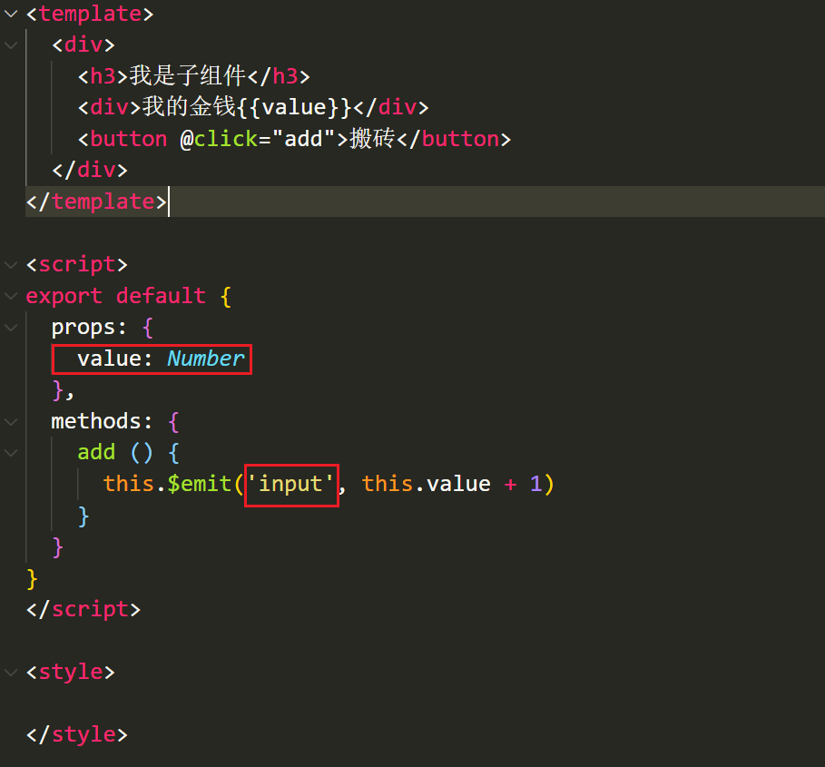
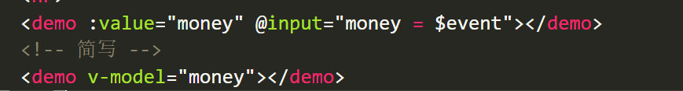
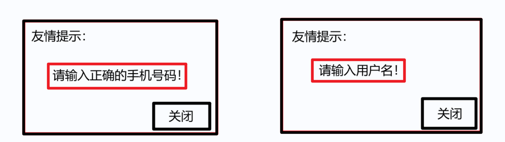
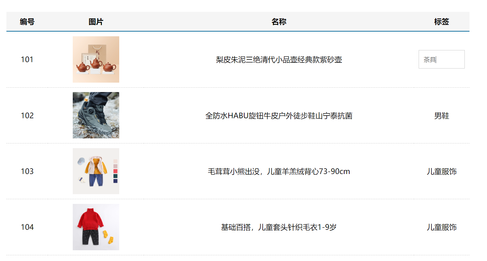
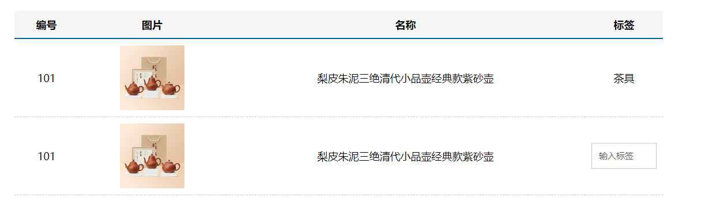
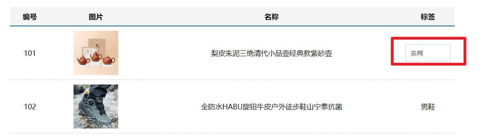

# v-model

## v-model 语法糖

语法糖：v-model本质上是 value属性和input事件的一层包装

  v-model的作用：提供数据的双向绑定

- 数据发生了改变，页面会自动变  v-bind:value
- 页面输入改变 ，   数据会自动变化  v-on:input

v-model是语法糖， v-model等价于 给一个input框提供了 :value属性以及 @input事件

很显然如果每次使用input框，都需要提供value和input事件，比较麻烦，所以使用v-model

```jsx
<template>
  <div>
    <input type="text" v-model="msg">
    <input type="text" :value="msg" @input="msg = $event.target.value">

    <input type="text" :value="car" @input="car = $event.target.value">
    <input type="text" v-model="car">
  </div>
</template>
```


## v-model给组件使用

我们经常遇到一种场景： 

1. 父组件提供一个数据给子组件使用（父传子）
2. 子组件又需要修改父组件传过来的这个数据，所以需要子传父把值传给父组件。

 这种场景可以使用v-model进行简写。

+ 定义组件的时候，注意接收的值叫value， 子传父触发的事件叫 input



+ 父传子给子组件传递value属性和input事件




# ref 和 $refs 

利用 ref 和 $refs 可以用于获取 dom 元素, 或者组件实例

每个 vue 的组件实例上，都包含一个$refs 对象，里面存储着对应的DOM 元素或组件的引用。

1 给需要获取的 dom 元素或者组件, 添加 ref 属性

```jsx
<div>
  <div ref="box">我是div盒子</div>
  <jack ref="jack"></jack>
  <button @click="fn">按钮</button>
</div>
```

2 通过 `this.$refs.xxx` 获取, 拿到组件可以调用组件的方法

```jsx
import Jack from './jack.vue'
export default {
  methods: {
    fn () {
      console.log(this.$refs.box)
      console.log(this.$refs.jack)
      this.$refs.jack.sayHi()
    }
  },
  components: {
    Jack
  }
}
```

# $nextTick

**需求1: 点击按钮, 切换显示输入框**

```vue
<template>
  <div>
    <!-- 需求: 点击按钮, 切换显示输入框 -->
    <input type="text" v-if="isShowInput">
    <button @click="fn" v-else>点此搜索</button>
  </div>
</template>

<script>
export default {
  data () {
    return {
      isShowInput: false
    }
  },
  methods: {
    fn () {
      this.isShowInput = true
    }
  }
}
</script>
```

**需求2: 显示输入框的同时, 要获取焦点**

当文本框展示出来之后，如果希望它立即获得焦点，则可以为其添加 ref 引用，并调用原生 DOM 对象的.focus() 方法即可。

直接调用会报错, 因为 vue 是 异步dom更新的 (提升渲染效率),  `this.isShowInput = true` 执行完时, 实际的 dom 还没渲染出来

```jsx
<input ref="inp" type="text" v-if="isShowInput">

fn () {
  this.isShowInput = true
  this.$refs.inp.focus()
}
```

组件的 `$nextTick(callback)` 方法，会把 callback 回调推迟到下一个 DOM 更新周期之后执行。

通俗的理解是：**等组件的DOM 刷新之后，再执行 callback 回调函数**。从而能保证 callback 函数可以操作到最新的 DOM 元素。

```vue
<template>
  <div>
    <!-- 需求: 点击按钮, 切换显示输入框 -->
    <input ref="inp" type="text" v-if="isShowInput">
    <button @click="fn" v-else>点此搜索</button>
  </div>
</template>

<script>
export default {
  data () {
    return {
      isShowInput: false
    }
  },
  methods: {
    fn () {
      this.isShowInput = true
      this.$nextTick(() => {
        this.$refs.inp.focus()
      })
    }
  }
}
</script>
```


# dynamic 动态组件

## 动态组件的基本使用

什么是动态组件:   让多个组件使用同一个挂载点，并动态切换，这就是动态组件 

```vue
<template>
  <div>
    <h3>动态组件的演示</h3>
    <!-- 动态组件 => 多个组件使用同一个挂载点, 并可以动态的切换展示 -->
    <button @click="comName = 'my-swiper'">swiper</button>
    <button @click="comName = 'my-nav'">nav</button>
    
    <!-- 
      <my-nav></my-nav>
      <my-swiper></my-swiper> 
    -->
    <component :is="comName"></component>
  </div>
</template>

<script>
import MyNav from './my-nav.vue'
import MySwiper from './my-swiper.vue'
export default {
  data () {
    return {
      comName: 'my-nav'
    }
  },
  components: {
    MyNav,
    MySwiper
  }
}
</script>
```


# 自定义指令

## 自定义指令说明

https://www.vue3js.cn/docs/zh/guide/custom-directive.html

除了核心功能默认内置的指令 (`v-model` 和 `v-show`)，Vue 也允许注册自定义指令。 `v-xxx`  

注意，代码复用和抽象的主要形式是组件。

然而，有的情况下，你仍然需要对普通 DOM 元素进行底层操作，这时候就会用到自定义指令。

## 自定义指令 - 局部注册

例如需求:  当页面加载时，让元素将获得焦点 , (autofocus 在 safari 浏览器有兼容性)

```less
<template>
  <div>
    <h3>自定义指令</h3>
    <input ref="inp" type="text" v-focus>
  </div>
</template>

<script>
export default {
  directives: {
    // 自定义一个局部指令
    focus: {
      inserted (el) {
        el.focus()
      }
    }
  }
}
</script>
```

## 自定义指令 - 全局注册

```jsx
// 注册全局自定义指令
Vue.directive('focus', {
  inserted (el) {
    el.focus()
  }
})
```

## 自定义指令 - 指令的值

在绑定指令时，可以通过“等号”的形式为指令绑定具体的参数值

需求: v-color="color" 给对应的颜色, 就能改对应的字体颜色

```jsx
<div v-color="color">我是内容</div>
```

实现:

```jsx
directives: {
  // 自定义一个局部指令
  color: {
    // 指令所在的元素渲染的时候
    inserted (el, {value}) {
      el.style.color = value
    },
    // update指令的值改变时触发, binding.value指令的值修改触发
    update (el, binding) {
      el.style.color = binding.value
    }
  }
}
```


# 插槽

插槽（Slot）是 vue 为组件的封装者提供的能力。

允许开发者在封装组件时，把不确定的、希望由用户指定的部分定义为插槽。

## 默认插槽 slot

**需求: 要在页面中显示一个对话框, 封装成一个组件**



通过父传子, 固然可以完成一定层面的组件的定制, 但是自定义性较差, 

如果希望能够自定义组件内部的一些结构 => 就需要用到插槽


**插槽作用: 用于实现组件的内容分发, 通过 slot 标签, 可以接收到写在组件标签内的内容**

插槽：slot  作用：占位置

基本示例:

```jsx
<my-dialog>
  <p>请输入正确的手机号码</p>
</my-dialog>
```

`my-dialog.vue`

```less
<template>
  <div class="my-dialog">
    <div class="header">
      <h3>友情提示</h3>
    </div>
    <div class="content">
      <slot></slot>
    </div>
    <div class="footer">
      <button>关闭</button>
    </div>
  </div>
</template>

<script>
export default {

}
</script>

<style lang="less" scoped>
.my-dialog {
  width: 400px;
  padding: 10px 20px;
  border: 3px solid #000;
  border-radius: 5px;
  margin: 10px;
}
</style>
```


## 后备内容 (默认值)

封装组件时，可以为预留的 `<slot>` 插槽提供后备内容（默认内容）。

如果组件的使用者没有为插槽提供任何内容，则后备内容会生效。

```jsx
<template>
  <div class="my-dialog">
    <div class="header">
      <h3>友情提示</h3>
    </div>
    <div class="content">
      <slot>这是后备内容</slot>
    </div>
    <div class="footer">
      <button>关闭</button>
    </div>
  </div>
</template>
```


## 具名插槽

### 插槽的分类:

**1 默认插槽(匿名插槽)**

`<slot></slot>` 只要没有具体分发的内容, 都会给到默认插槽

`<slot name="default"></slot>` 是默认插槽完整的写法 和 `<slot></slot>` 完全等价

**2 具名插槽: 具有名字的插槽 (配置了名字),  可以实现定向分发**

一旦配置了名字, 只会接收对应的内容, 不是分发给他的, 就不要


### 具名插槽的使用步骤

(1) 给插槽起名字 

```jsx
<div class="header">
  <slot name="header"></slot>
</div>
<div class="content">
  <slot>这是后备内容</slot>
</div>
<div class="footer">
  <slot name="footer"></slot>
</div>
```

(2) 需要使用 template 标签, 将内容包裹成一个整体

(3) 通过 v-slot:插槽名, 指定具体分发给谁

```html
<my-dialog>
  <template v-slot:header>
    <h3>这是大标题</h3>
  </template>

  <template v-slot:default>
    <p>这是内容</p>
  </template>

  <template v-slot:footer>
    <button>确认</button>
    <button>取消</button>
  </template>
</my-dialog>
```


### 具名插槽的简写

跟 v-on 和 v-bind 一样，v-slot 也有缩写，即把参数之前的所有内容 (v-slot:) 替换为字符 #。

例如 v-slot:header 可以被简写为 #header

```jsx
<my-dialog>
  <template #header>
    <h3>这是大标题</h3>
  </template>

  <template #default>
    <p>这是内容</p>
  </template>

  <template #footer>
    <button>确认</button>
    <button>取消</button>
  </template>
</my-dialog>
```


## 作用域插槽

作用域插槽: **定义 slot 插槽的同时, 是可以传值的**, 将来在分发内容时, 可以使用

1. 给 slot 标签, 以 添加属性的方式传值

```jsx
<slot name="bottom" :yes="yes" :no="no" money="100"></slot>
```

2. 所有添加的属性, 都会被收集到一个对象中

```js
{ yes: '确认', no: '取消', money: '100' }
```

3. 在template中, 通过  `v-slot:插槽名= "obj"` 接收

```jsx
<template #bottom="obj">
  <!-- {{ obj }} -->
  <button>{{ obj.yes }}</button>
  <button>{{ obj.no }}</button>
  <button>{{ obj.money }}</button>
</template>
```

4. 可以使用解构赋值简化数据的接收

```jsx
<template #bottom="{ yes, no, money }">
  <button>{{ yes }}</button>
  <button>{{ no }}</button>
  <button>{{ money }}</button>
</template>
```


# 案例 - 商品列表

## 案例概览




## 静态结构

效果图：



直接拷贝到App.vue即可

```jsx
<template>
  <div class="table-case">
    <table class="my-table">
      <thead>
        <tr>
          <th>编号</th>
          <th>图片</th>
          <th>名称</th>
          <th width="100px">标签</th>
        </tr>
      </thead>
      <tbody>
        <tr>
          <td>101</td>
          <td></td>
          <td>梨皮朱泥三绝清代小品壶经典款紫砂壶</td>
          <td>
            <div class="my-tag">
              <!-- <input
                class="input"
                type="text"
                placeholder="输入标签"
              /> -->
              <div class="text">茶具</div>
            </div>
          </td>
        </tr>
        <tr>
          <td>101</td>
          <td></td>
          <td>梨皮朱泥三绝清代小品壶经典款紫砂壶</td>
          <td>
            <div class="my-tag">
              <input
                class="input"
                type="text"
                placeholder="输入标签"
              />
              <!-- <div class="text">{{ value }}</div> -->
            </div>
          </td>
        </tr>
      </tbody>
    </table>
  </div>
</template>

<script>
export default {
  name: 'TableCase',
  data () {
    return {
      goods: [
        { id: 101, picture: 'https://yanxuan-item.nosdn.127.net/f8c37ffa41ab1eb84bff499e1f6acfc7.jpg', name: '梨皮朱泥三绝清代小品壶经典款紫砂壶', tag: '茶具' },
        { id: 102, picture: 'https://yanxuan-item.nosdn.127.net/221317c85274a188174352474b859d7b.jpg', name: '全防水HABU旋钮牛皮户外徒步鞋山宁泰抗菌', tag: '男鞋' },
        { id: 103, picture: 'https://yanxuan-item.nosdn.127.net/cd4b840751ef4f7505c85004f0bebcb5.png', name: '毛茸茸小熊出没，儿童羊羔绒背心73-90cm', tag: '儿童服饰' },
        { id: 104, picture: 'https://yanxuan-item.nosdn.127.net/56eb25a38d7a630e76a608a9360eec6b.jpg', name: '基础百搭，儿童套头针织毛衣1-9岁', tag: '儿童服饰' },
      ]
    }
  }
}
</script>

<style lang="less" scoped>
.table-case {
  width: 1000px;
  margin: 50px auto;
  img {
    width: 100px;
    height: 100px;
    object-fit: contain;
    vertical-align: middle;
  }
}

.my-table {
  width: 100%;
  border-spacing: 0;
  img {
    width: 100px;
    height: 100px;
    object-fit: contain;
    vertical-align: middle;
  }
  th {
    background: #f5f5f5;
    border-bottom: 2px solid #069;
  }
  td {
    border-bottom: 1px dashed #ccc;
  }
  td,
  th {
    text-align: center;
    padding: 10px;
    transition: all .5s;
    &.red {
      color: red;
    }
  }
  .none {
    height: 100px;
    line-height: 100px;
    color: #999;
  }
}

.my-tag {
  cursor: pointer;
  .input {
    appearance: none;
    outline: none;
    border: 1px solid #ccc;
    width: 100px;
    height: 40px;
    box-sizing: border-box;
    padding: 10px;
    color: #666;
    &::placeholder {
      color: #666;
    }
  }
}
</style>
```


## 封装 MyTag  组件



核心需求：

1. 双击显示输入框，并回显标签信息
2. 失去焦点，隐藏输入框
3. 修改标签信息，回车,   显示修改后的标签文本


### 新建 MyTag 组件

新建 `components/MyTag.vue` 文件

```vue
<template>
  <div class="my-tag">
    <!-- <input
      class="input"
      type="text"
      placeholder="输入标签"
    /> -->
    <div class="text">茶具</div>
  </div>
</template>

<script>
export default {

}
</script>

<style lang="less">
.my-tag {
  cursor: pointer;
  .input {
    appearance: none;
    outline: none;
    border: 1px solid #ccc;
    width: 100px;
    height: 40px;
    box-sizing: border-box;
    padding: 10px;
    color: #666;
    &::placeholder {
      color: #666;
    }
  }
}
</style>
```

App页面中注册使用

```vue
<template>
  <div class="table-case">
    <table class="my-table">
      ...
      <tbody>
        <tr>
          <td>101</td>
          <td></td>
          <td>梨皮朱泥三绝清代小品壶经典款紫砂壶</td>
          <td>
            <MyTag></MyTag>
          </td>
        </tr>
      </tbody>
    </table>
  </div>
</template>

<script>
import MyTag from './components/MyTag.vue'

export default {
  name: 'TableCase',
  ...
  components: {
    MyTag
  }
}
</script>
```


### 双击显示

1. my-tag盒子注册双击事件

```jsx
<div class="my-tag" @dblclick="open">
```

2. 提供数据，利用v-if控制显示隐藏

```jsx
<template>
  <div class="my-tag" @dblclick="open">
    <input
      v-if="edit"
      class="input"
      type="text"
      placeholder="输入标签"
    />
    <div v-else class="text">茶具</div>
  </div>
</template>

<script>
export default {
  data () {
    return {
      edit: false
    }
  },
  methods: {
    open () {
      this.edit = true
    }
  }
}
</script>
```


### 显示自动获取焦点

自定义指令 - 自动获取焦点

```vue
<template>
  <div class="my-tag" @dblclick="open">x`
    <input
      v-if="edit"
      v-focus
      class="input"
      type="text"
      placeholder="输入标签"
    />
    <div v-else class="text">茶具</div>
  </div>
</template>

<script>
export default {
  ...
  directives: {
    focus: {
      inserted (el) {
        el.focus()
      }
    }
  }
}
</script>
```


### 失去焦点自动隐藏

1. 注册blur事件

```jsx
<input
  v-if="edit"
  v-focus
  @blur="close"
  class="input"
  type="text"
  placeholder="输入标签"
/>
```

2. 控制隐藏

```jsx
close () {
  this.edit = false
}
```


### 控制表单文本绑定

两个数据区分：

- 注意1：输入框内显示的，是my-tag子组件内的数据

- 注意2：文本标签显示的，是父组件传递过来的数据

步骤：

1. 父组件App.vue， v-model 绑定数据

```jsx
<MyTag v-model="msg"></MyTag>

data () {
  return {
    ...
    msg: '测试标签'
  }
},
```

2. 子组件MyTag.vue接收渲染

```jsx
<div v-else class="text">{{ value }}</div>

props: {
  value: String
},
```

3. 子组件MyTag.vue提供数据，并绑定

```jsx
data () {
  return {
    edit: false,
    tag: '标签'
  }
},
    
<template>
  <div class="my-tag" @dblclick="open">
    <input
      v-if="edit"
      v-focus
      v-model.trim="tag"
      @blur="close"
      class="input"
      type="text"
      placeholder="输入标签"
    />
    <div v-else class="text">{{ value }}</div>
  </div>
</template>
```

4. 双击显示时回显

```jsx
open () {
  this.edit = true
  this.tag = this.value
},
```

5. 回车时、失去焦点时提交

```jsx
<input
  v-if="edit"
  v-focus
  v-model.trim="tag"
  @blur="close"
  @keyup.enter="close"
  class="input"
  type="text"
  placeholder="输入标签"
/>


close () {
  this.edit = false
  if (this.tag === '') {
    this.tag = '暂无'
  }
  this.$emit('input', this.tag)
}
```


## 封装 MyTable 组件

### 新建MyTable 组件

```jsx
<template>
  <table class="my-table">
    <thead>
      <tr>
        <th>编号</th>
        <th>图片</th>
        <th>名称</th>
        <th width="100px">标签</th>
      </tr>
    </thead>
    <tbody>
      <tr>
        <td>101</td>
        <td></td>
        <td>梨皮朱泥三绝清代小品壶经典款紫砂壶</td>
        <td>
          标签
        </td>
      </tr>
    </tbody>
  </table>
</template>

<script>
export default {

}
</script>

<style lang="less" scoped>
.my-table {
  width: 100%;
  border-spacing: 0;
  img {
    width: 100px;
    height: 100px;
    object-fit: contain;
    vertical-align: middle;
  }
  th {
    background: #f5f5f5;
    border-bottom: 2px solid #069;
  }
  td {
    border-bottom: 1px dashed #ccc;
  }
  td,
  th {
    text-align: center;
    padding: 10px;
    transition: all .5s;
    &.red {
      color: red;
    }
  }
  .none {
    height: 100px;
    line-height: 100px;
    color: #999;
  }
}
</style>
```


### 父传子 - 传入数组 - 循环渲染

父组件

```vue
<MyTable :data="goods"></MyTable>
```

子组件

```jsx
<template>
  <table class="my-table">
    <thead>
      <tr>
        <th>编号</th>
        <th>图片</th>
        <th>名称</th>
        <th width="100px">标签</th>
      </tr>
    </thead>
    <tbody>
      <tr v-for="item in data" :key="item.id">
        <td>{{ item.id }}</td>
        <td></td>
        <td>{{ item.name }}</td>
        <td>
          {{ item.tag }}
        </td>
      </tr>
    </tbody>
  </table>
</template>

<script>
export default {
  name: 'MyTable',
  props: {
    data: {
      type: Array,
      default: () => [],
    },
  },
}
</script>
```


### 基本插槽处理

为了提高组件的复用性，最好把表格的  标题区域 预留为  `<slot>`  插槽，

方便使用者自定义表格的标题, 且内容部分要和标题部分对应, 所以也应该定义成插槽

```jsx
<template>
  <table class="my-table">
    <thead>
      <tr>
        <slot name="head"></slot>
      </tr>
    </thead>
    <tbody>
      <tr v-for="item in data" :key="item.id">
        <slot name="row" :row="item"></slot>
      </tr>
    </tbody>
  </table>
</template>
```

### 表格封装完成

```vue
<template>
  <div class="table-case">
    <MyTable :data="goods">
      <template #head>
        <th>编号</th>
        <th>图片</th>
        <th>名称</th>
        <th width="100px">标签</th>
      </template>

      <template #row="{ row }">
        <td>{{ row.id }}</td>
        <td></td>
        <td>{{ row.name }}</td>
        <td>
          <MyTag v-model="row.tag"></MyTag>
        </td>
      </template>
    </MyTable>
  </div>
</template>

<script>
import MyTag from './components/MyTag.vue'
import MyTable from './components/MyTable.vue'

export default {
  name: 'TableCase',
  data () {
    return {
      goods: [
        { id: 101, picture: 'https://yanxuan-item.nosdn.127.net/f8c37ffa41ab1eb84bff499e1f6acfc7.jpg', name: '梨皮朱泥三绝清代小品壶经典款紫砂壶', tag: '茶具' },
        { id: 102, picture: 'https://yanxuan-item.nosdn.127.net/221317c85274a188174352474b859d7b.jpg', name: '全防水HABU旋钮牛皮户外徒步鞋山宁泰抗菌', tag: '男鞋' },
        { id: 103, picture: 'https://yanxuan-item.nosdn.127.net/cd4b840751ef4f7505c85004f0bebcb5.png', name: '毛茸茸小熊出没，儿童羊羔绒背心73-90cm', tag: '儿童服饰' },
        { id: 104, picture: 'https://yanxuan-item.nosdn.127.net/56eb25a38d7a630e76a608a9360eec6b.jpg', name: '基础百搭，儿童套头针织毛衣1-9岁', tag: '儿童服饰' },
      ],
    }
  },
  components: {
    MyTag,
    MyTable
  }
}
</script>
```


