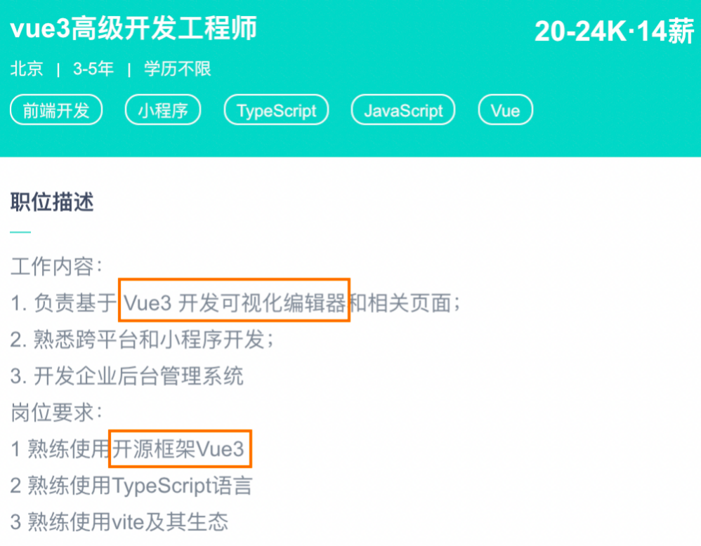
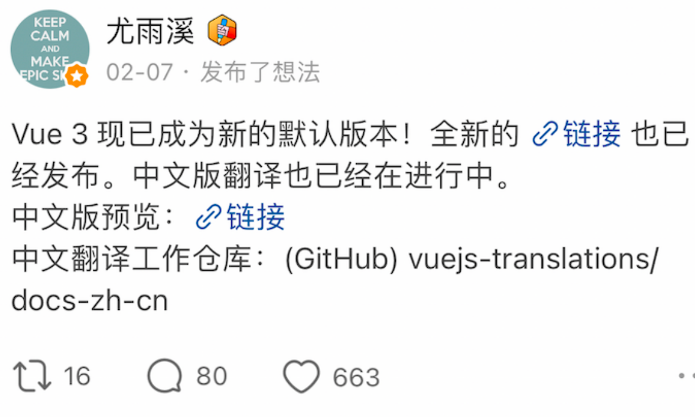
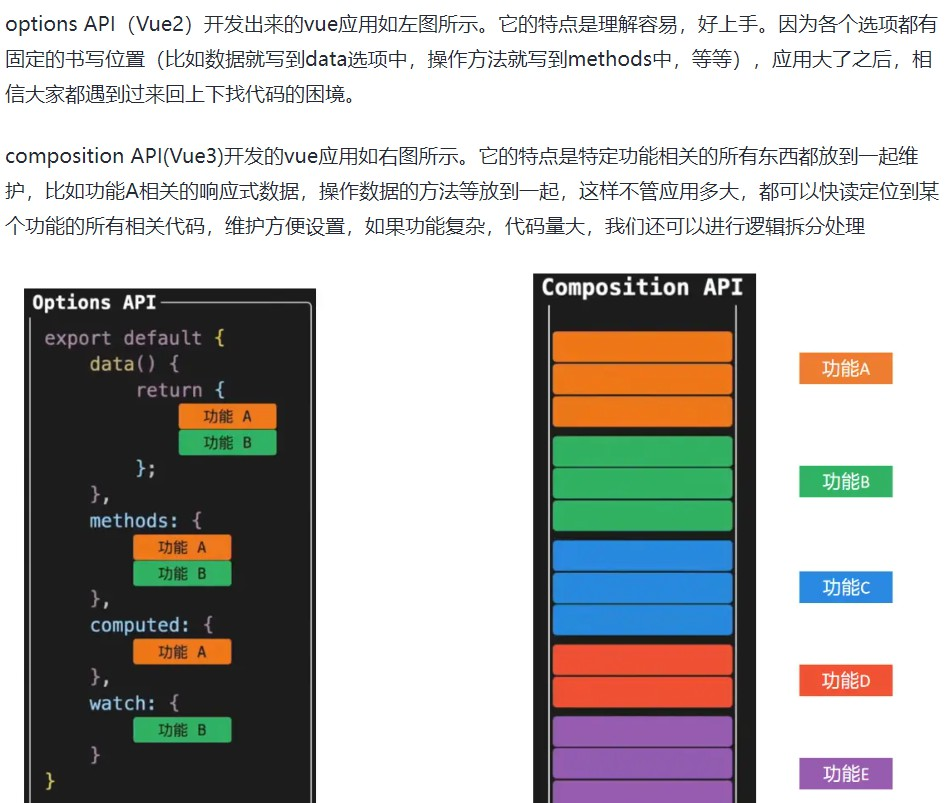
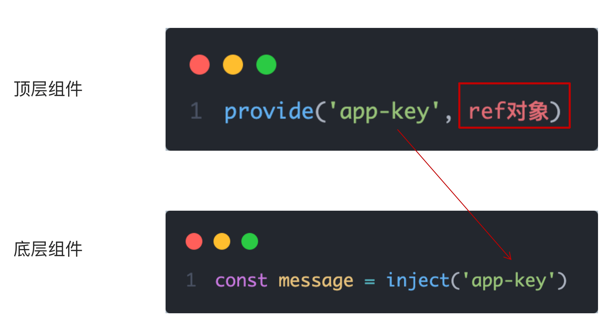

## 1. 认识Vue3
### 1. Vue3组合式API体验

为什么要学vue3: 

1. Vue是国内最火的前端框架
2. Vue 3 于 2022 年 2 月 7 日星期一成为新的默认版本！
3. Vue3性能更高，体积更小
4. Vue3.0在经过一年的迭代后，越来越好用






### 2. Vue3更多的优势


**面试中需要回答出来的点，v3与v2的区别**

1. 数据响应式的原理重新实现（proxy 替代了 Object.defineProperty）
2. 支持了ts，更好的类型推导，减少bug的产生
3. 提供了组合式api，更适合大型项目
4. 更好的treeShakin 摇树，减少打包的体积
5. diff算法的更新

## 2.使用create-vue搭建Vue3项目

### 1. 认识create-vue
> create-vue是Vue官方新的脚手架工具，底层切换到了 vite （下一代前端工具链），为开发提供极速响应


### 2. 使用create-vue创建项目
> 前置条件 - 已安装16.0或更高版本的Node.js

执行如下命令，这一指令将会安装并执行 create-vue
```bash
npm init vue@latest
交互选项 最后一项也选择 yes
```


> 自己下课思考以下，给你个需求，从零搭建配置一个vue3的项目，不看视频和课件以及笔记，怎么开始？

> 怎么样切换自己电脑的node环境？

## 3. 熟悉项目和关键文件
1. VS code 安装2个插件插件
  1. Vue Language Features (Volar) 
  2. TypeScript Vue Plugin (Volar)
2. 关闭插件Vetur


**之前项目保存不能格式化的同学参考下面配置**

```
我们的vscode代码能否实现保存自动格式化，取决于下载的插件 + settings.json的配置

下面的配置，可以在当前项目的根目录，有个.vscode 隐藏文件夹，在里面新建一个 settings.json配置文件，
就可以在当前项目里面，相同的属性配置，覆盖我们的vscode默认的配置。不影响我们之前的配置，
动手能力强的同学，可以直接去到我们自己 vscode里面的settings.json文件，会直接粘贴覆盖我们代码即可

"editor.codeActionsOnSave": {
  "source.fixAll": true,
  "source.fixAll.eslint": true,
},
"[javascript]": {
  "editor.formatOnSave": true,
  "editor.defaultFormatter": "esbenp.prettier-vscode"
},
"[vue]": {
  "editor.formatOnSave": true,
  "editor.defaultFormatter": "esbenp.prettier-vscode"
},
```


## 4. 组合式API - setup选项

### 0. 前置知识点

- 组合式API 与选项式API
- setup 函数是 Vue3 特有的选项，作为组合式API的起点
- 从组件生命周期看，它在 beforeCreate 之前执行
- 函数中 this 不是组件实例，是 undefined
- 如果数据或者函数在模板中使用，需要在 setup 返回



### 1. setup选项的写法和执行时机

写法
```vue
<script>
  export default {
    setup(){
      
    },
    beforeCreate(){
      
    }
  }
</script>
```
执行时机
> 在beforeCreate钩子之前执行


### 2. setup中写代码的特点
> 在setup函数中写的数据和方法需要在末尾以对象的方式return，才能给模版使用

```vue
<script>
  export default {
    setup(){
      const message = 'this is message'
      const logMessage = ()=>{
        console.log(message, this)
      }
      // 必须return才可以
      return {
        message,
        logMessage
      }
    }
  }
</script>
```
### 3. `<script setup>`语法糖

**官方推荐：https://cn.vuejs.org/api/sfc-script-setup.html**

**setup的历史进程： https://github.com/vuejs/core/blob/main/CHANGELOG.md**

> script标签添加 setup标记，不需要再写导出语句，默认会添加导出语句

```vue
<script setup>
  const message = 'this is message'
  const logMessage = ()=>{
    console.log(message, this)
  }
</script>
```

## 5. 组合式API - reactive和ref函数
### 1. reactive
> 接受对象类型数据的参数传入并返回一个响应式的对象

**思考：为什么需要用一个导入一个？**

> 是为了让我们的项目尽可能的轻量化，在tree-shaking 摇树，打包的时候，尽可能的去掉没有使用的代码


```vue
<script setup>
 // 导入
 import { reactive } from 'vue'
 // 执行函数 传入参数 变量接收
 const state = reactive({
   msg:'this is msg'
 })
 const setSate = ()=>{
   // 修改数据更新视图
   state.msg = 'this is new msg'
 }
</script>

<template>
  {{ state.msg }}
  <button @click="setState">change msg</button>
</template>
```

### 2. ref
> 接收简单类型或者对象类型的数据传入并返回一个响应式的对象

reactive 处理的数据, 必须是复杂类型,  如果是简单类型无法处理成响应式, 所以有 ref 函数!

作用: 对传入的数据（一般简单数据类型），包裹一层对象,  转换成响应式。

1. ref 函数接收一个的值, 返回一个ref 响应式对象,  有唯一的属性 value
2. 在 setup 函数中, 通过 ref 对象的 value 属性, 可以访问到值
3. 在模板中, ref 属性会自动解套, 不需要额外的 .value
4. ref函数也支持传入复杂类型，传入复杂类型，也会做响应式处理

```vue
<script setup>
 // 导入
 import { ref } from 'vue'
 // 执行函数 传入参数 变量接收
 const count = ref(0)
 const setCount = ()=>{
   // 修改数据更新视图必须加上.value
   count.value++
 }
</script>

<template>
  <button @click="setCount">{{count}}</button>
</template>
```
### 3. reactive 对比 ref

1. 都是用来生成响应式数据
2. 不同点
   1. reactive不能处理简单类型的数据
   2. ref参数类型支持更好，但是必须通过.value做访问修改
   3. ref函数内部的实现依赖于reactive函数
3. 在实际工作中的推荐
   1. 推荐使用ref函数，减少记忆负担，优医问诊项目都使用ref
## 6. 组合式API - computed
> 计算属性基本思想和Vue2保持一致，组合式API下的计算属性只是修改了API写法

```vue
<script setup>
// 导入
import {ref, computed } from 'vue'
// 原始数据
const count = ref(0)
// 计算属性
const doubleCount = computed(()=>count.value * 2)

// 原始数据
const list = ref([1,2,3,4,5,6,7,8])
// 计算属性list
const filterList = computed(item=>item > 2)
</script>
```
## 7. 组合式API - watch
> 侦听一个或者多个数据的变化，数据变化时执行回调函数，俩个额外参数 immediate控制立刻执行，deep开启深度侦听

### 1. 侦听单个数据
```vue
<script setup>
  // 1. 导入watch
  import { ref, watch } from 'vue'
  const count = ref(0)
  // 2. 调用watch 侦听变化
  watch(count, (newValue, oldValue)=>{
    console.log(`count发生了变化，老值为${oldValue},新值为${newValue}`)
  })
</script>
```
### 2. 侦听多个数据
> 侦听多个数据，第一个参数可以改写成数组的写法

```vue
<script setup>
  // 1. 导入watch
  import { ref, watch } from 'vue'
  const count = ref(0)
  const name = ref('cp')
  // 2. 调用watch 侦听变化
  watch([count, name], ([newCount, newName],[oldCount,oldName])=>{
    console.log(`count或者name变化了，[newCount, newName],[oldCount,oldName])
  })
</script>
```
### 3. immediate
> 在侦听器创建时立即出发回调，响应式数据变化之后继续执行回调


```vue
<script setup>
  // 1. 导入watch
  import { ref, watch } from 'vue'
  const count = ref(0)
  // 2. 调用watch 侦听变化
  watch(count, (newValue, oldValue)=>{
    console.log(`count发生了变化，老值为${oldValue},新值为${newValue}`)
  },{
    immediate: true
  })
</script>
```
### 4. deep
> 通过watch监听的ref对象默认是浅层侦听的，直接修改嵌套的对象属性不会触发回调执行，需要开启deep

```vue
<script setup>
  // 1. 导入watch
  import { ref, watch } from 'vue'
  const state = ref({ count: 0 })
  // 2. 监听对象state
  watch(state, ()=>{
    console.log('数据变化了')
  })
  const changeStateByCount = ()=>{
    // 直接修改不会引发回调执行
    state.value.count++
  }
</script>

<script setup>
  // 1. 导入watch
  import { ref, watch } from 'vue'
  const state = ref({ count: 0 })
  // 2. 监听对象state 并开启deep
  watch(state, ()=>{
    console.log('数据变化了')
  },{deep:true})
  const changeStateByCount = ()=>{
    // 此时修改可以触发回调
    state.value.count++
  }
</script>

```
## 8. 组合式API - 生命周期函数
### 1. 选项式对比组合式

### 2. 生命周期函数基本使用
> 1. 导入生命周期函数
> 2. 执行生命周期函数，传入回调

```vue
<scirpt setup>
import { onMounted } from 'vue'
onMounted(()=>{
  // 自定义逻辑
})
</script>
```
### 3. 执行多次
> 生命周期函数执行多次的时候，会按照顺序依次执行

```vue
<scirpt setup>
import { onMounted } from 'vue'
onMounted(()=>{
  // 自定义逻辑
})

onMounted(()=>{
  // 自定义逻辑
})
</script>
```
## 9. 组合式API - 父子通信
### 1. 父传子
> 基本思想
> 1. 父组件中给子组件绑定属性
> 2. 子组件内部通过props选项接收数据


### 2. 子传父
> 基本思想
> 1. 父组件中给子组件标签通过@绑定事件
> 2. 子组件内部通过 emit 方法触发事件


## 10. 组合式API - 模版引用
> 概念：通过 ref标识 获取真实的 dom对象或者组件实例对象

### 1. 基本使用
> 实现步骤：
> 1. 调用ref函数生成一个ref对象
> 2. 通过ref标识绑定ref对象到标签


### 2. defineExpose
> 默认情况下在 `<script setup>`语法糖下组件内部的属性和方法是不开放给父组件访问的，可以通过defineExpose编译宏指定哪些属性和方法容许访问
> 说明：指定testMessage属性可以被访问到


## 11. 组合式API - provide和inject
### 1. 作用和场景
> 顶层组件向任意的底层组件传递数据和方法，实现跨层组件通信


### 2. 跨层传递普通数据
> 实现步骤
> 1. 顶层组件通过 `provide` 函数提供数据
> 2. 底层组件通过 `inject` 函数提供数据


### 3. 跨层传递响应式数据
> 在调用provide函数时，第二个参数设置为ref对象



### 4. 跨层传递方法
> 顶层组件可以向底层组件传递方法，底层组件调用方法修改顶层组件的数据


## 12. 综合案例

### 1. 项目地址
```bash
git clone  https://gitee.com/errlei/vue3-basic-project.git
```
### 2. 项目说明

1. 模版已经配置好了案例必须的安装包
2. 案例用到的接口在 README.MD文件 中
3. 案例项目有俩个分支，master主分支为开发分支，complete分支为完成版分支供开发完参考
