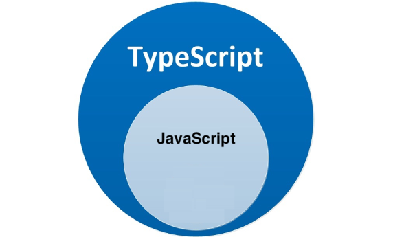
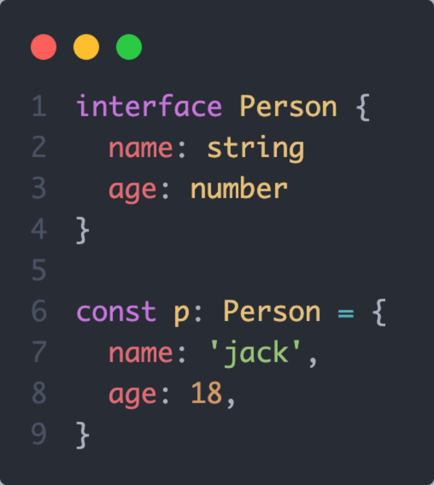
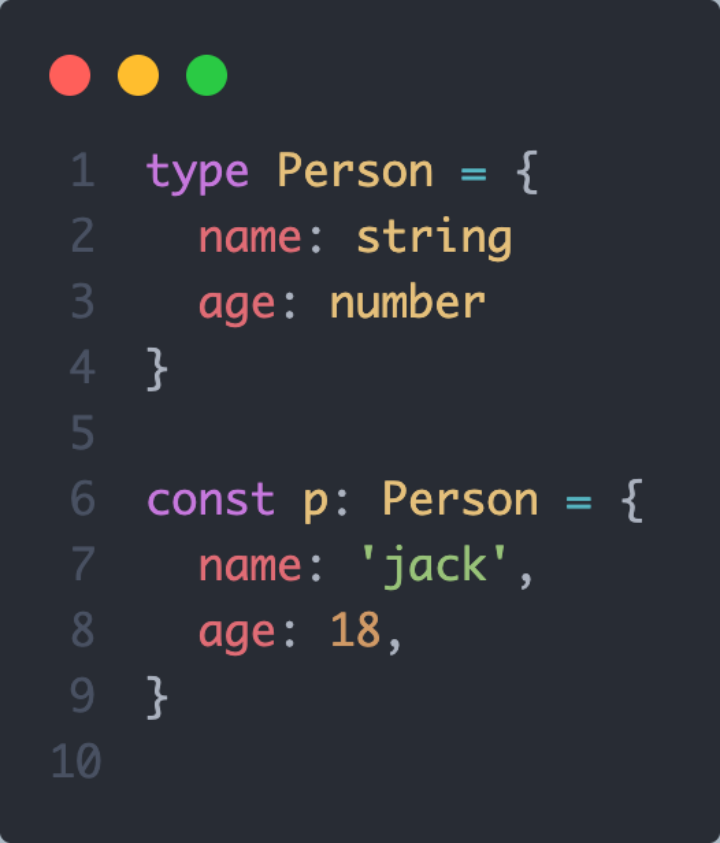
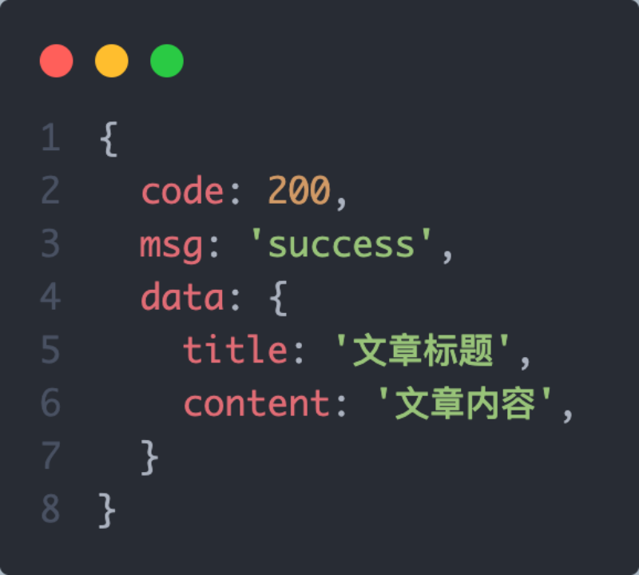
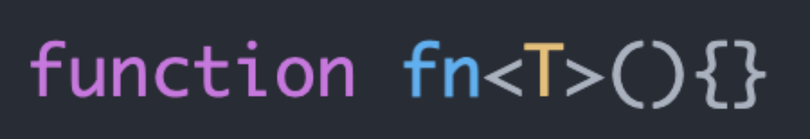
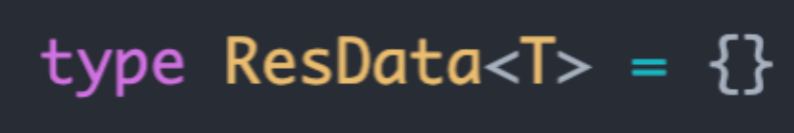

## 1. 认识TypeScript
### 1. 什么是TS
TypeScript 是具有类型语法的 JavaScript，是一门强类型的编程语言
.png)

+ `TypeScript` 简称：TS，是 JavaScript 的超集，简单来说就是：JS 有的 TS 都有

  

+ TypeScript = `Type` + JavaScript（在 JS 基础之上，**为 JS 添加了类型支持**）

+ TypeScript 是*微软*开发的开源编程语言，可以在任何运行 JavaScript 的地方运行


**常用网站**

> 工作里面练习方式 -- playground  ---  平常开发的时候，如果要测试一些框架新的功能，一般会采用线上的playground环境， 不会本地搭建环境，比较慢
>
> https://www.typescriptlang.org/zh/play
>
> https://playcode.io/vue
>
> https://bootstrap-vue.org/play


- [TS 官方文档](https://www.typescriptlang.org/)
- [TS 中文参考 - 不再维护](https://www.tslang.cn/)
- 自学网站： （https://ts.xcatliu.com/， http://www.patrickzhong.com/TypeScript/PREFACE.html）


### 2. 带来的好处

1- 静态类型检查，提前发现代码错误

.png)
.png)
2- 良好的代码提示，提升开发效率

.png)


**使用对比：**

- 使用 JS：
  1. 在 VSCode 里面写代码
  2. 在浏览器中运行代码 --> 运行时，才会发现错误【晚】
- 使用 TS：
  1. 在 VSCode 里面写代码 --> 写代码的同时，就会发现错误【早】
  2. 在浏览器中运行代码

### 3. 什么时候用

以下是来自社区的一些建议：

1. 你做的是一个大型的应用吗？
2. 是否是团队协作开发模式？
3. 是否在编写通用的代码库？（Vue3 / ElementPlus...）

结论：TypeScript不是万能的，技术的选型不能脱离具体的业务和应用场景，TS更加适合用来开发中大型的项目，或者是通用的JS代码库，再或者是团队协作开发的场景


**目前，前端最新的开发技术栈：**

1. React： **TS + Hooks **（facebook  instgram）
2. Vue： **TS + Vue3**  （个人，线下组织）
3. Angular： 全部框架都是ts写的，完全支持 （谷歌）

- 注意： Vue2 对 TS 的支持不好~


## 2. 搭建TS编译环境
### 1. 为什么需要编译环境
TypeScript编写的代码是无法直接在js引擎（浏览器/NodeJs）中运行的，最终还需要经过编译变成js代码才可以正常运行 
.png)

带来的好处：既可以再开发时使用TS编写代码享受类型带来的好处，同时保证实际运行的还是JS代码

### 2. 搭建手动编译环境

1.  全局安装 typescript 包（编译引擎）-> 注册 tsc 命令
 npm install -g typescript 
2.  新增 hello.ts 文件，  执行 tsc hello.ts 命令生成hello.js文件 
3.  执行 node hello.js 运行js文件查看效果 

### 3. 搭建工程化下的自动编译环境
基于工程化的TS开发模式（webpack / vite），TS的编译环境已经内置了，无需手动安装配置，通过以下命令即可创建一个最基础的自动化的TS编译环境 
```bash
npm create vite@latest   ts-pro  -- --template vanilla-ts
```
命令说明：

1. npm create vite[@latest ](/latest )   使用最新版本的vite创建项目 
2. ts-pro   项目名称
3. -- --template vanilla-ts     创建项目使用的模板为原生ts模板

## 3. 类型注解
### 1. TS类型注解是什么
概念：类型注解指的是给变量添加类型约束，使变量只能被赋值为约定好的类型, 同时可以有相关的类型提示

.png)

说明：:string 就是类型注解， 约束变量 message 只能被赋值为string 类型, 同时可以有string类型的相关提示
### 2. TS支持的常用类型注解
**JS已有类型**
1. 简单类型
    number  string  boolean  null  undefined
2. 复杂类型
    数组   函数
    **TS新增类型**
    联合类型、类型别名、接口（interface）、字面量类型、泛型、枚举、void、any等

### 3. 简单类型如何进行类型注解
简单类型的注解完全按照 JS的类型（全小写的格式）来书写即可

.png)

## 4. 数组类型注解
### 1. 有什么用
变量被注解为数组类型之后，有俩点好处：
1- 不仅可以限制变量类型为数组而且可以限制数组成员的类型
.png)

2- 编码时不仅可以提示数组的属性和方法而且可以提示成员的属性和方法
.png)

### 2. 如何注解数组类型
使用数据类型对变量进行类型注解有俩种语法

.png)

### 3. 思考题
有一个变量arr, 要求用俩种方式添加类型注解，使其只能赋值一个成员都是字符串的数组?

## 5. 联合类型和别名类型
### 1. 联合类型
概念：将多个类型合并为一个类型对变量进行注解
需求：如何注解数组类型可以让数组中既可以存放string类型的成员也可以存放number类型的成员？
.png)
说明：string | number 表示arr3中的成员既可以是string类型也可以是number类型

### 2. 类型别名
概念：通过 type关键词 给写起来较复杂的类型起一个其它的名字，用来简化和复用类型
.png)

说明：type 类型别名 = 具体类型  其中类型别名的命名采用规范的大驼峰格式
### 3. 思考题
有一个变量foo,要求添加类型注解，使其既可以赋值为number类型，也可以赋值为成员都是字符串的数组?
## 6. 函数类型
### 1. 基础使用
概念：函数类型是指给函数添加类型注解，本质上就是给函数的参数和返回值添加类型约束

.png)

说明：

1. 函数参数注解类型之后不但限制了参数的类型还限制了参数为必填
2. 函数返回值注解类型之后限制了该函数内部return出去的值必须满足类型要求

好处：

1. 避免因为参数不对导致的函数内部逻辑错误     2.  对函数起到说明的作用

### 2. 函数表达式
函数表达式的类型注解有俩种方式，参数和返回值分开注解和函数整体注解

1- 参数和返回值分开注解

.png)

2-函数整体注解（只针对于函数表达式）

.png)

### 3. 可选参数
概念：可选参数表示当前参数可传可不传，一旦传递实参必须保证参数类型正确

.png)
说明：lastName参数表示可选参数，可传可不传，一旦传递实参必须保证类型为string类型

### 4. 无返回值 - void
概念：JS中的有些函数只有功能没有返回值，此时使用void进行返回值注解，明确表示函数没有函数值

.png)

注意事项：在JS中如何没有返回值，默认返回的是undefined, 在TS中 void和undefined不是一回事，undefined在TS中是一种明确的简单类型，如果指定返回值为undefined，那返回值必须是undefined类型
### 5. 思考题
编写一个arr2Str函数，作用为把数组转换为字符串，其中数组中既可以包含字符串和数字，分隔符也可以进行自定义，类型为字符串类型，使用样例：

1. arr2Str( [1, 2, 3] ,  '-' )    ->   '1-2-3'
2. arr2Str( [‘4’, ’5’] , ’&’ )  -> '4&5'
## 7. interface接口
### 1. 接口类型的作用
作用: 在TS中使用interface接口来描述对象数据的类型（常用于给对象的属性和方法添加类型约束）


说明：一旦注解接口类型之后对象的属性和方法类型都需要满足要求，属性不能多也不能少

### 2. 典型场景
场景：在常规业务开发中比较典型的就是前后端数据通信的场景

1. 前端向后端发送数据：收集表单对象数据时的类型校验
2. 前端使用后端数据：渲染后端对象数组列表时的智能提示

.png)

### 3. 接口的可选设置
概念: 通过？对属性进行可选标注，赋值的时候该属性可以缺失，如果有值必须保证类型满足要求
.png)

### 4. 接口的继承
概念：接口的很多属性是可以进行类型复用的，使用 extends 实现接口继承,实现类型复用
.png)

### 5. 思考题
通常我们的后端接口返回的数据格式具有一定的规范，比如经常见到的response对象，如下，尝试使用interface接口定义其类型


## 8. type注解对象类型
### 1. 注解对象
概念：在TS中对于对象数据的类型注解，除了使用interface之外还可以使用类型别名来进行注解，作用相似



### 2. type + 交叉类型模拟继承
类型别名配合交叉类型（&）可以模拟继承，同样可以实现类型复用

.png)

### 3. interface 对比 type
1. type可以定义单个变量类型、联合类型、对象，interface只能定义对象
2. type不可以重复声明，interface可以重复声明(声明合并);

在注解对象类型的场景下非常相似，推荐大家一律使用type, type更加灵活

```typescript
type Iprops = {
    name: string
    age: number
}
type Iprops:string = "111"

interface MyInterface {
    name: string
    age: number
}
interface MyInterface {
	gender: string
}
const obj: MyInterface= {
    name: "string"
    age: 18,
    gender: "男",
}
// 重复声明相当于把两个类型加一块
```


### 4. 思考题
还是我们熟悉的response对象，如下，尝试使用type定义其类型



## 9. 字面量类型
### 1. 什么是字面量类型
概念：使用 js字面量 作为类型对变量进行类型注解，这种类型就是字面量类型, 字面量类型比普通的类型更加精确

.png)

说明：除了上面的数字字面量，js里常用的字符串字面量，数组字面量，对象字面量等都可以当成类型使用
### 2. 字面量类型的实际应用
字面量类型在实际应用中通常和联合类型结合起来使用，提供一个精确的可选范围
场景1：性别只能是 ’男‘ 和 ’女‘，就可以采用联合类型配合字面量的类型定义方案
.png)

场景2：ElementUI中的el-button组件按钮的type属性
.png)

### 3. 字面量类型与const
思考一下下面的 str1 和 str2，TS推断出来的类型分别是什么？
.png)
说明：const声明的变量称之为常量，常量是不可以进行重新赋值的，所以str2推断出来的是字面量类型而不是string类型

### 4. 思考题
还是我们熟悉的后端返回数据，这一次业务code码有多种情况1001、 1002、 1003，尝试改写类型满足要求
.png)

## 10. 类型推论和any类型
### 1. 类型推论
概念：在 TS 中存在类型推断机制，在没有给变量添加类型注解的情况下，TS 也会给变量提供类型，以下是发生类型推断的几个场景

- 声明变量并赋值时

.png)

- 决定函数返回值时

.png)

一些小建议

1. 开发项目的时候，能省略类型注解的地方就省略
2. 刚开始学TS，建议对所有类型都加上，先熟悉
3. 鼠标放至变量上，VsCode 自动提示类型
### 2. any类型
作用：变量被注解为any类型之后，TS会忽略类型检查，错误的类型赋值不会报错，也不会有任何提示

.png)

 注意：any 的使用越多，程序可能出现的漏洞越多，因此不推荐使用 any 类型，尽量避免使用
### 3. 类型断言
作用：有些时候开发者比TS本身更清楚当前的类型是什么，可以使用断言（as）让类型更加精确和具体
需求：获取页面中的id为link的a元素，尝试通过点语法访问href属性

.png)

.png)

### 4. 类型断言的注意事项
类型断言只能够「欺骗」TypeScript 编译器，无法避免运行时的错误，滥用类型断言可能会导致运行时错误

.png)

说明：利用断言把foo变量的类型指定为精确的number，但是传参的时候还是可以传递number类型或者string类型均满足类型要求，但是传递string会导致运行时错误
## 11. 泛型
### 1.泛型-基本介绍
- 泛型（Generics）是指在定义接口、函数等类型的时候，不预先指定具体的类型，而在使用的时候再指定类型的一种特性, 使用泛型可以复用类型并且让类型更加灵活
- 泛型就是**解决 类 接口 方法的复用性**、以及对不特定数据类型的支持(类型校验)


### 2. 泛型函数
语法：在函数名称的后面使用`<T>`即可声明一个泛型参数，整个函数中（参数、返回值、函数体）的变量都可以使用该参数的类型

思考函数的类型不一样，怎么去定义函数的类型

```typescript
// 传入什么类型就返回什么类型
function a(val:string):string{
  return val
}
function b(val:number):number{
  return val
}

// 要是工作里面忘记了，可以使用any 可以解决这个问题，但放弃了类型检查，传入返回导致不一致
function a(val:any):any{
  return val
}
```


**2.1  引入泛型变量，来复用函数类型**

```typescript
// <T> 表示泛型，调用这个方法时来决定类型
function fn<T>(val:T):T{
  return val
}
fn<string>('val') // ok
fn<number>(123) // ok
fn<string>(123) // 错误
```


**2.2 思考，一个函数接受两个参数，两个参数类型相同，返回该类型的元素组成的数组？参数类型任意**

```
function getData<T>(x:T,y:T):T[]{
  let arr : T[] = [x,y]
  return arr
}

getData<string>('a','b')
getData<number>(1,2)
```


**2.3 思考题：一个函数接受两个参数，两个参数类型不同，返回的数组是这两个元素数组的数组，参数类型任意**

```typescript
function duble<K,V>(val1:K,val2:V):[K,V]{
  return [val1,val2]
}
```



需求：设置一个函数 createArray，它可以创建一个指定长度的数组，同时将每一项都填充一个默认值(多种类型)
.png)


### 2. 泛型接口

思考：下面的俩种数据结构如何使用interface接口实现类型注解？这样做有何问题？
.png)

语法：在接口类型的名称后面使用`<T>`即可声明一个泛型参数，接口里的其他成员都能使用该参数的类型

.png)

通用思路：

1. 找到可变的类型部分通过泛型抽象为泛型参数（定义参数）
2. 在使用泛型的时候，把具体类型传入到泛型参数位置 （传参）

.png)
### 3. 泛型别名
语法：在类型别名type的后面使用`<T>`即可声明一个泛型参数，接口里的其他成员都能使用该参数的类型



需求：使用泛型别名重构ResData案例
.png)

### 5. 泛型约束
作用：泛型的特点就是灵活不确定，有些时候泛型函数的内部需要访问一些特定类型的数据才有的属性，此时会有类型错误，需要通过泛型约束解决

.png)

添加约束

.png)


## 12. 高级TS知识点 --- 关键字 --- 了解（面试题）

##### 1. keyof 

**keyof 用于获取某种类型的所有键(类似于Object.keys())，其返回类型是联合类型**

```typescript
interface Person {
  name: string;
  age: number;
  location: string;
}

// 下面代码类似于  type K1 = // "name" | "age" | "location"
type K1 = keyof Person  // // "name" | "age" | "location"
const key: K1 = 'name'

// 看做有点鸡肋，不过核心是搭配其他关键词使用
```


##### 2. keyof + extends

```typescript
// 1. 一个函数，根据对象不同key返回不同的value值，
function prop1(obj, key) {
  return obj[key];
}
// 如果函数这样写的话，在ts里面不能通过，因为没有定义obj和key的类型
// 先这样改动
function prop2(obj: object, key: string) {
  return obj[key];
}
// 上面代码报红色错误，元素隐式地拥有 any 类型，因为 string 类型不能被用于索引 {} 类型。要解决这个问题，你可以使用以下非常暴力的方案
function prop3(obj: object, key: string) {
  return (obj as any)[key];
}
// 虽然不报错了，但是也失去了ts的作用，和js没有任何区别，但是在工作里面，要是搞不定某个类型，就用any，快速完成领导需求也可以，后面再慢慢完善。我们这里给大家推荐一个好办法
function prop4<T extends object, K extends keyof T>(obj: T, key: K) {
  return obj[key];
}
// 解释：首先定义了 T 类型并使用 extends 关键字约束该类型必须是 object 类型的子类型，然后使用 keyof 操作符获取 T 类型的所有键，其返回类型是联合类型，最后利用 extends 关键字约束 K 类型必须为 keyof T 联合类型的子类型

// 测试代码
type Todo = {
  id: number;
  text: string;
  done: boolean;
}

const todo: Todo = {
  id: 1,
  text: "Learn TypeScript keyof",
  done: false
}

function prop5<T extends object, K extends keyof T>(obj: T, key: K) {
  return obj[key];
}

const id = prop5(todo, "id"); // const id: number
const text = prop5(todo, "text"); // const text: string
const done = prop5(todo, "done"); // const done: boolean

// 尝试访问不存在得值， 报红，成功阻止我们尝试读取不存在的属性
const date = prop5(todo, "date");
```


##### 3. in 

```typescript
// in 其实就像是遍历一样
type Keys1 = "a" | "b"
type Obj1 =  {
  [p in Keys1]: number
} 
// 等价于 type Obj = { a: any, b: any }
const obj1: Obj1 = {
  a: 1,
  b: 2
}

type Keys2 = 'a' | 'b' | 'c';
type Obj2 = { 
    [ T in Keys2]: string;
}
// in 遍历 Keys，并为每个值赋予 string 类型
 
// type Obj = {
//     a: string,
//     b: string,
//     c: string
// }
const obj2: Obj2 = {
  a: '11',
  b: '22',
  c: '33'
}
// keyof 后面跟的是类型， 和in一样都是类型
type TT1 = keyof Obj2 // 等价于 'a'|'b'|'c'
const a: TT1 = 'a' 
```


##### 4. 内置类型别名 -- 了解几个即可

> https://github.com/SunshowerC/blog/issues/15

**Pick、Readonly、Partial、Required 等**

```typescript
// Pick 从 T 中过滤出属性 K
// 源码定义 
type Readonly<T> = {
    readonly [P in keyof T]: T[P];
};

// 使用场景
interface UserInfo {
  id: string;
  name: string;
}
type NewUserInfo = Pick<UserInfo, 'name'>;
```

``` typescript
Partial  将类型 T 的所有属性标记为可选属性 ------------- Required反面，将所有属性标记为必选属性

// 别人的写法
type Partial<T> = {
    [P in keyof T]?: T[P];
};

// 账号属性
interface AccountInfo {
    name: string 
    email: string 
    age: number 
    vip: 0|1 // 1 是vip ，0 是非vip
}

// 当我们需要渲染一个账号表格时，我们需要定义
const accountList: AccountInfo[] = []

// 但当我们需要查询过滤账号信息，需要通过表单，
// 但明显我们可能并不一定需要用到所有属性进行搜索，此时可以定义
const model: Partial<AccountInfo> = {
  name: '',
  vip: undefind
}
```


```
Pick
这个类型则可以将某个类型中的子属性挑出来，变成包含这个类型部分属性的子类型
源码
type Pick<T, K extends keyof T> = {
    [P in K]: T[P];
};
从源码可以看到 K 必须是 T 的 key，然后用 in 进行遍历, 将值赋给 P, 最后 T[P] 取得相应属性的值

Readonly
这个类型的作用是将传入的属性变为只读选项
// 源码 node_modules/typescript/lib/lib.es5.d.ts

type Readonly<T> = {
    readonly [P in keyof T]: T[P];
};
给子属性添加 readonly 的标识，如果将上面的 readonly 改成 -readonly， 就是移除子属性的 readonly 标识

Partial 的作用就是可以将某个类型里的属性全部变为可选项 ?
//源码 node_modules/typescript/lib/lib.es5.d.ts

type Partial<T> = {
    [P in keyof T]?: T[P];
};
可以看到 keyof T 拿到 T 所有属性名, 然后 in 进行遍历, 将值赋给 P, 最后 T[P] 取得相应属性的值. 结合中间的 ?，将所有属性变为可选
```


## 13. 综合案例

需求：记录当前页面的刷新次数和刷新时的时间，每次刷新都自动自增一次，并显示到页面中，要求用TypeScript实现

.png)
核心思路

1. 从本地获取到当前最新列表，取出当前列表中的最后一条记录
2. 在最后一条记录的基础上把次数加一,重新把次数和当前时间添加到列表的尾部
3. 把最新列表渲染到页面
4. 把最新列表再次存入本地


**自己的结果导向思维：**

**1.1** 渲染多条数据到页面上

```typescript
const appDom = (document.getElementById('app') as HTMLDivElement)
appDom.innerHTML = '刷新次数为:10,刷新时间为12:12'

// 因为原型图上面是显示的多条数据，肯定是一个数组的形式，类似于数组里面一个元素，就对应页面上一条数据
const list = [1,2,3,4,5]
appDom.innerHTML = list.map(item => {
  return '刷新次数为:10,刷新时间为:12:12'
}).join('<br>')
```

**1.2 更改list数组为动态内容，定义数组类型**

```typescript
// 代码改造，因为刷新的次数和刷新的时间，都是动态的可以变的，所以我们的数组元素应该是一个个对象
// 对象的结构类似 {count: 1,  time: '12:12:12'}
const list = [
  {count: 1,  time: '12:12:12'},
  {count: 1,  time: '12:12:12'},
  {count: 1,  time: '12:12:12'}
]
// 又因为是ts，定义的函数或者变量都需要有类型，所有定义一个数组类型，结合接口
interface Item {
  count: number,
  time: string
}
const list: Item[] = [
  {count: 1,  time: '12:12:12'},
  {count: 2,  time: '12:12:12'},
  {count: 3,  time: '12:12:12'}
]

appDom.innerHTML = list.map((item:Item) => {
  return `刷新次数为:${item.count},刷新时间为${item.time}`
}).join('<br>')
```


**1.3 开始准备真实的list数据，思考： 刷新数据还存在，数据放哪里？**

```typescript
// 本地存储，涉及到localStorage的操作，一般会封装为两个函数，一个获取，一个设置。因为不能存对象的原因
const key = 'ts-refresh'
function getList(key: string): Item[] {
  return JSON.parse(localStorage.getItem(key) || '[]')
}

function setList(key: string, list: Item[]): void {
  localStorage.setItem(key, JSON.stringify(list))
}
```


**1.4  封装思想--- 本地存储拿，操作显示完成以后，再存入到本地存储里面。核心操作，大家需要着重练习的点！！！**

```typescript
const key = 'ts-refresh'
function updateData() {
  // 获取数据 --- 将外面的假数据修改了拿过来
  const list: Item[] = getList(key)

  // list变量拿进来以后， 外面的渲染找不到list这个变量，所以要将外面的代码也拿进来
  
  appDom.innerHTML = list.map((item:Item) => {
    return `刷新次数为:${item.count},刷新时间为${item.time}`
  }).join('<br>')

  // 还需要将修改的数据，例如事件和次数，在保存到本地存储里面
  // 要保存的数据，先写个假的，等下再写时间和次数
  setList(key, [
    {count: 1, time: '12:12:12'},
  ])
}

// 每次页面刷新要执行的函数
updateData()
```


**1.5 在把之前setList里面的没有写完的次数，和时间功能补全，一定是先写大致框架，在写具体**

```typescript
function updateData() {
  const list: Item[] = getList(key)

  // 将最后一条数据获取到，在此基础之上进行操作，然后渲染并且保存
  // 注意数据获取不到的时候，对应的类型
  const lastItem: Item | undefined = list[list.length - 1]
  list.unshift({
    count: lastItem ? lastItem.count + 1 : 1,
    time: getFormatTime()
  })

  appDom.innerHTML = list.map((item:Item) => {
    return `刷新次数为:${item.count},刷新时间为${item.time}`
  }).join('<br>')

  setList(key, list)
}

//再封装一个自定义时间格式化的函数
function getFormatTime() {
  const _time = new Date()
  const h = _time.getHours()
  const m = _time.getMinutes()
  const s = _time.getSeconds()
  return `${h}:${m}:${s}`
}
```


**1.6 代码写完，优化封装 -- 收工**

```
1. 抽离封装思想
2. 时间函数优化
   `${h > 10 ? h : '0' + h}:${m > 10 ? m : '0' + m}:${s > 10 ? s : '0' + s}`
3. 抽离公共代码到对应的问题，例如utils等
4. 业务逻辑优化，是否要将最新的刷新次数放在首位
	const lastItem: Item | undefined = list[0]
	list.unshift(...)
```


> 参考代码

```javascript
// 先主线逻辑 后细节

function updateData() {
  // 1. 获取最新列表 取到最后一项
  const list = getList()
  const lastItem = list[list.length - 1]
  // 2. 在上一条记录的基础上count + 1 配合当前时间添加到列表的尾部
  list.push({
    count: lastItem ? lastItem.count + 1 : 1,
    time: getFormatTime(),
  })
  // 3. 最新列表渲染到页面
  render(list)
  // 4. 最新列表存入本地
  setList(list)
}

type Item = {
  count: number
  time: string
}
const KEY = 'ts-key'
function getList(): Item[] {
  // TODO
  return JSON.parse(localStorage.getItem(KEY) || '[]')
}

// console.log(getList())

function setList(list: Item[]) {
  // TODO
  localStorage.setItem(KEY, JSON.stringify(list))
}
// setList([{ count: 1, time: '10:10:10' }])

function getFormatTime() {
  // TODO
  const _time = new Date()
  const h = _time.getHours()
  const m = _time.getMinutes()
  const s = _time.getSeconds()
  return `${h}:${m}:${s}`
}

// console.log(getFormatTime())
function render(list: Item[]) {
  // TODO
  // 1. 把list中每个对象格式化成字符串
  const strArr = list.map((item) => {
    return `刷新次数为:${item.count},刷新时间为:${item.time}`
  })
  // 2. 调用dom api渲染到页面中
  const app = document.getElementById('app') as HTMLDivElement
  app.innerHTML = strArr.join('<br>')
}

updateData()
```

