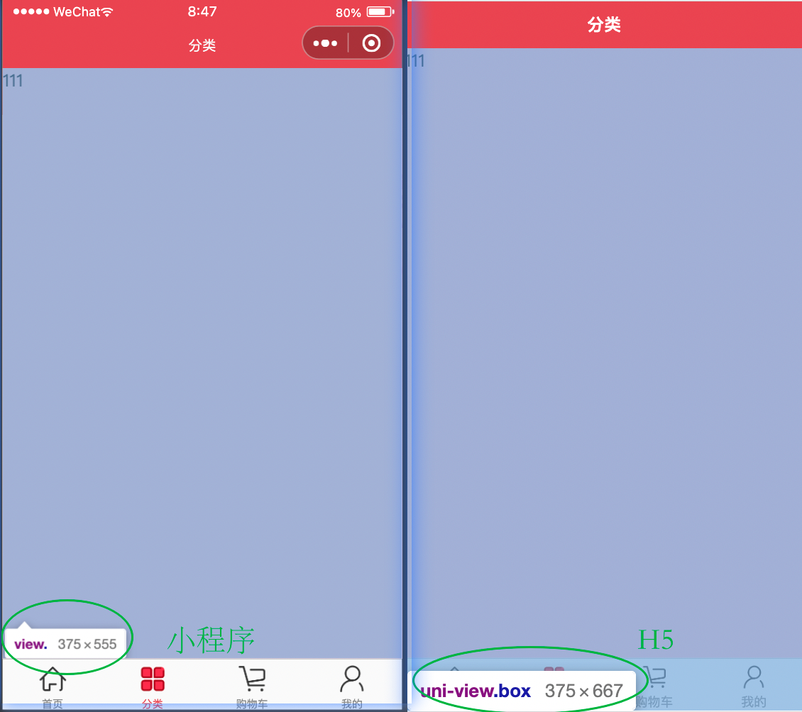
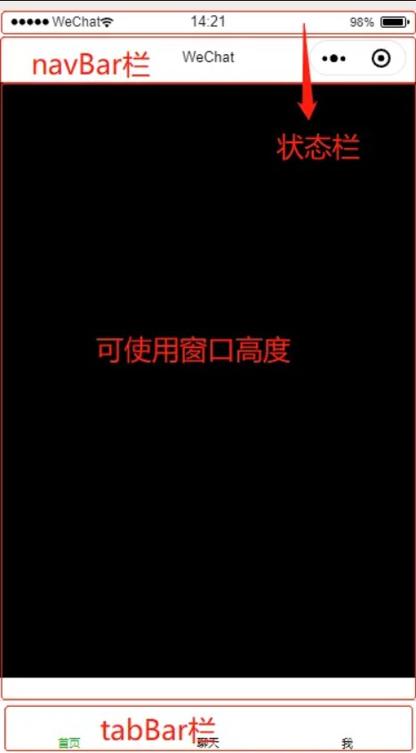

# day08-uni-app项目

## 01.uni-app介绍
### 目标
认识uni-app，了解uni-app的特点
### 今日课程安排

-  uni app 介绍 & 初体验 
-  uni app 目录结构 
-  uni app 生命周期 
-  uni api 
-  easycom 组件引入 
-  uview 使用 
-  黑马优购首页 
### uni-app简介
uni-app 是一个使用**Vue.js **开发所有前端应用的框架，开发者编写一套代码，可发布到iOS、Android、Web（响应式）、以及各种小程序（微信/支付宝/百度/头条/QQ/钉钉/淘宝）、快应用等多个平台<br />选择 uni-app 框架两个主要原因：

1. 使用 Vue.js 语法开发
2. 支持编译成多端

官网地址：[https://uniapp.dcloud.net.cn/](https://uniapp.dcloud.net.cn/)
### 相关面试题
说一下你们项目为啥选uni-app而不是用原生小程序做开发？
### 小结

1.  uni-app的特点 
   1. 使用 Vue.js 语法开发
   2. 支持编译成多端

## 02.uni-app初体验
### 目标
能通过vue-cli脚手架创建uni-app项目
### 思路
uni app 官网提供了两种 创建

1. uni app 项目的方式使用 配套的开发工具 HBuilderX ，可视化的方式来创建和开发项目使用
2. 基于 vue-cli 脚手架 来创建和开发项目**（老师推荐）**
### 核心步骤

1.  全局安装脚手架 
   - **npm install -g @vue/cli@4 ** （**切记安装4.x.x的版本**）
   - vue -V
2.  使用脚手架创建 uni app 项目 
   -  **vue create -p dcloudio/uni-preset-vue my-project** 
   -  如有模板选择选  **默认模板**
3.  编译 uni app 项目 
   - **npm run serve**
4.  体验成功 
5.  Vscode 插件安装 **uni-helper** 
### 小结

1. vue-cli一定选**4.x**的版本。
2. 模板选**默认模板**
3. 项目创建指令**vue create -p dcloudio/uni-preset-vue my-project**
## 03.uni-app项目导入
### 目标
能在微信开发者工具中体验uni-app项目 ---  优购项目启动

```
git clone https://gitee.com/errlei/ugo_89
```


### 核心步骤

1.  填入appid 
   -  找到 src/manifest.json 内的第57行，填入 appid 
```json
"mp-weixin": { /* 微信小程序特有相关 */
  "appid": "", // 这里填入appid
  "setting": {
    "urlCheck": false
  },
  "usingComponents": true
},
```


2.  运行编译 uni app 项目 
   -  在项目根目录下运行 **npm run dev:mp-weixin** 
3.  微信开发者工具导入uniapp项目 
   - 打开微信开发者工具 导入uni app项目  路径是 /dist/dev/mp-weixin
4.  导入成功 
### 小结

1. manifest.json文件内填appid
2. npm run dev:mp-weixin编译
3. 微信开发者工具的导入路径是 /dist/dev/mp-weixin

## 04.uni-app目录结构
### 目标
了解uni-app目录结构，知道每个文件的作用及用途。<br />src目录结构<br />
## 05. uni-app生命周期
### 目标
了解uni-app的各种生命周期，知道其触发时机。
### uni-app生命周期简介

- 作用： 
   - 生命周期是一堆会在特定时期执行的函数
- 分类： 
   1. 应用生命周期   使用小程序的规范 
      - onLaunch
   2. 页面生命周期   使用小程序的规范 
      - onLoad
   3. 组件生命周期   使用vue的规范 
      - created
### 小结

1. 应用及页面生命周期，使用小程序的规范
2. 组件生命周期，使用vue规范
## 06.uni-app的api
### 目标
了解uni-app的api与微信原生api的区别，知道其特点。
### uni api简介
uni-api 指的是uni-app 针对一些 微信小程序api所做的封装它解决了两个问题

1. 原生的小程序api不支持promise形式的调用（需要自己封装）
2. 原生的微信小程序api不支持跨平台
### uni api使用

1. 改前缀。如 wx.request 修改 为 uni.request 即可。
2. 如果该方法有返回值，那么 返回值是一个数组，第1项为错误信息，第2项才是想要的返回结果
```javascript
async onLoad() {
  // 小程序练习请求接口： https://cnodejs.org/api/v1/topic/5433d5e4e737cbe96dcef312
  // 如果模拟器报错    [Symbol.iterator]()  含有这些字段， 那么就不能使用解构赋值
  const [error, res] = await uni.request({
  url: 'https://cnodejs.org/api/v1/topic/5433d5e4e737cbe96dcef312'
  });
  console.log(res);
}
```
### 小结

1. uni api支持promise格式调用
2. async  await调用时返回的是一个数组，数组的第一项表示错误信息，第2项表示返回结果
## 07.uni-app自定义组件—传统方式
### 目标
熟练掌握uni-app自定义组件——传统方式的使用
### 核心步骤

1. 创建组件
2. 引入组件
3. 注册组件
4. 使用组件


## 08.uni-app自定义组件—easycom
### 目标
熟练掌握uni-app自定义组件——easycom方式的使用
### 简介
easycom是uni-app提供的一种更加简单使用组件的规范
### 核心步骤

1. 创建组件 
   - 必须按照固定格式创建组件 **/components/组件名称/组件名称.vue**
2. 使用组件


### 小结
easycom的组件的命名格式是？
## 09.uni-app组件库uViewUI
### 目标
熟练掌握uview的使用
### [uview介绍](https://www.uviewui.com/)
uView UI，是uni-app生态最优秀的UI框架，全面的组件和便捷的工具会让您信手拈来，如鱼得水

官方里面推荐的是 [uni-ui](https://uniapp.dcloud.net.cn/component/uniui/uni-ui.html)

### 关键步骤

[官网参考地址](https://www.uviewui.com/components/npmSetting.html)

1.  安装依赖 (**注意：项目名称不能有中文字符**) 
```bash
// 安装sass
npm i sass -D

// 安装sass-loader，注意需要版本10，否则可能会导致vue与sass的兼容问题而报错
npm i sass-loader@10 -D

// 安装uview-ui
npm install uview-ui@2.0.31
```

2.  全局引入uview js库
```javascript
import uView from "uview-ui";
Vue.use(uView);
```


3.  全局引入uView的全局SCSS主题文件 
```css
/* uni.scss */
@import 'uview-ui/theme.scss';
```


4.  全局引入uview 基础样式 
```vue
// 在App.vue中首行的位置引入，注意给style标签加入lang="scss"属性
  <style lang="scss">
  /* 注意要写在第一行，同时给style标签加入lang="scss"属性 */
  @import "uview-ui/index.scss";
</style>
```


5.  配置easycom模式引入uview组件 
```json
// pages.json
{
  "easycom": {
    "^u-(.*)": "uview-ui/components/u-$1/u-$1.vue"
  },
  // 此为本身已有的内容
  "pages": [
    // ......
  ]
}
```

6.  配置vue.config.js文件 
```javascript
// vue.config.js，如没有此文件则手动创建 放入项目根目录下
module.exports = {
    transpileDependencies: ['uview-ui']
}
```


7.  使用uview组件 
```html
<u-button type="primary" :disabled="disabled" text="禁用"></u-button>
<u-button type="primary" loading loadingText="加载中"></u-button>
<u-button type="primary" icon="map" text="图标按钮"></u-button>
<u-button type="primary" shape="circle" text="按钮形状"></u-button>
<u-button type="primary" size="small" text="大小尺寸"></u-button>
```
## 10.黑马优购项目介绍
### 目标
了解黑马优购项目
### 简介
黑马优购是一个基于微信小程序的在线电商项目，微信用户可以在黑马优购上选购喜好的商品，商城提供了浏览商品、筛选商品、收藏商品、加入购物车、在线支付功能。是一个可以满足企业级需要的真实项目。
### 技术栈
uni-app + vuex + uviewUI<br />工作职责：

1. 负责xx模块
2. 登录基本流程  token无感刷新
3. 使用vuex完成购物车模块
4. 不要写的：wx.navigateTo完成页面跳转 使用wx.setStorageSync完成token的本地化存储
5. 完成公共组件封装
6. 性能优化 千万不要写自己不了解的 如cdn


没有UI图，大家使用老师发的写好的打包好的目录跑起来项目，当做UI图

然后再打开一个新的小程序开发者工具，开发自己的项目


### 素材
接口文档：[https://www.showdoc.com.cn/128719739414963](https://www.showdoc.com.cn/128719739414963)
## 11.项目配置—窗口样式和tabBar
### 目标
熟练掌握新建页面及配置页面路径
### 核心步骤

1.  配置窗口样式 
2.  配置tabBar 
   1. 新建页面
   2. 配置路径
   3. 配置tabBar
### 参考代码
```json
{
	"easycom": {
		"^u-(.*)": "uview-ui/components/u-$1/u-$1.vue"
	},
	"pages": [ //pages数组中第一项表示应用启动页，参考：https://uniapp.dcloud.io/collocation/pages
		{
			"path": "pages/index/index",
			"style": { // 相当于每个页面的json
				"navigationBarTitleText": "黑马优购"
			}
		},
		{
			"path": "pages/category/index",
			"style": {
				"navigationBarTitleText": "分类"
			}
		},
		{
			"path": "pages/cart/index",
			"style": {
				"navigationBarTitleText": "购物车"
			}
		},
		{
			"path": "pages/my/index",
			"style": {
				"navigationBarTitleText": "我的"
			}
		}
	],
	"globalStyle": { // 相当于app.json里的window
		"navigationBarTextStyle": "white",
		"navigationBarTitleText": "黑马优购",
		"navigationBarBackgroundColor": "#EA4350",
		"backgroundColor": "#F8F8F8"
	},
	"tabBar": {
		"color": "#8C8D8D",
		"selectedColor": "#EA4350",
		"backgroundColor": "#FAFAFA",
		"list": [{
			"text": "首页",
			"pagePath": "pages/index/index",
			"iconPath": "/static/tabBar/home.png",
			"selectedIconPath": "/static/tabBar/home-o.png"
		}, {
			"text": "分类页",
			"pagePath": "pages/category/category",
			"iconPath": "/static/tabBar/category.png",
			"selectedIconPath": "/static/tabBar/category-o.png"
		}, {
			"text": "购物车",
			"pagePath": "pages/cart/cart",
			"iconPath": "/static/tabBar/cart.png",
			"selectedIconPath": "/static/tabBar/cart-o.png"
		}, {
			"text": "我的",
			"pagePath": "pages/my/my",
			"iconPath": "/static/tabBar/my.png",
			"selectedIconPath": "/static/tabBar/my-o.png"
		}]
	}
}
```


## 13.首页—顶部搜索框
### 目标
能熟练查阅uview文档，能借助文档完成控件的使用。
### 思路
对照UI图，找到相应的组件。
### 示例代码
```html
// 注意组件定义的位置和名称 easyCom 模式要符合
<view class="m-search">
  <u-search
  placeholder="搜索"
  v-model="keyword"
  :showAction="false"
  inputAlign="center"
  ></u-search>
</view>

<style lang="scss">
/* 编译成 页面.wxss */
.search {
  padding: 10rpx 25rpx;
  background-color: #eb4450;
}
</style>
```
## 14.首页—轮播图
### 目标
完成轮播图模块的渲染
### 核心步骤

1. 根据UI图完成结构样式搭建
   - 小程序原生网站看示例 （注意写法），是小程序的写法，在uni-app里面需要改写法
   - 去uni-app官方看组件，是vue的写法 [文档](https://uniapp.dcloud.net.cn/component/swiper.html)
2. 发请求获取真实数据
3. 套用真实数据完成渲染

```vue
<template>
  <view>
		<!-- 轮播图区域 -->
		<view class="m-swiper">
			<swiper
				indicator-dots
				autoplay
				circular
				indicator-active-color="#EA4350"
				indicator-color="rgba(0,0,0,0.4)"
			>
				<swiper-item v-for="item in swiperList" :key="item.goods_id">
					<image
						:src="item.image_src"
						mode="widthFix"
					/>
				</swiper-item>
			</swiper>
		</view>
  </view>
</template>

<script>
export default {
  data() {
    return {
			// 轮播图列表
			swiperList: []
    };
  },
	onLoad() {
		// 调用函数发送请求
		this.getSwiperList();
	},	
	methods: {
		// 获取轮播图函数
		async getSwiperList() {
			const [error, res] = await uni.request({
				url: 'https://api-hmugo-web.itheima.net/api/public/v1/home/swiperdata'
			});
			if (!error) {
				this.swiperList = res.data.message;
			}
		}
	}
};
</script>

<style>
.m-swiper,
.m-swiper image{
	width: 750rpx;
	height: 340rpx;
}
</style>
```

## 15.首页—http请求封装 --- 优化请求发送方式
### 目标
熟练掌握uview网络请求库的使用
### 核心步骤

[uview-ui请求的写法文档](https://www.uviewui.com/js/http.html)

1.  配置请求基地址 
```javascript
uni.$u.http.setConfig((config) => {
  /* config 为默认全局配置*/
  config.baseURL = 'https://api-hmugo-web.itheima.net/api/public/v1';
  return config
})
```

2.  设置请求拦截器，显示加载提示 
```javascript
// 设置请求拦截器
uni.$u.http.interceptors.request.use((config) => { // 可使用async await 做异步操作
  uni.showLoading();
  return config
}, config => { // 可使用async await 做异步操作
  return Promise.reject(config)
})
```

3.  设置响应拦截器，关闭加载提示 
```javascript
// 设置响应拦截器
uni.$u.http.interceptors.response.use((response) => {
  uni.hideLoading();
  return response
}, (response) => {
  return Promise.reject(response)
});
```

4. 将首页的请求更换为$u.http的形式

```javascript
uni.$u.http.request({xxxxx})
```


## 16.首页—入口导航

### 目标
完成入口导航模块
### 核心步骤

1. 根据UI图完成结构样式搭建
2. 发请求获取真实数据
3. 套用真实数据完成渲染
```vue
<template>
  <view>
    <!-- 入口导航模块 -->
    <view class="m-nav">
      <template v-for="item in navList">
        <navigator
					v-if="item.name === '分类'"
          url="/pages/category/index"
          :open-type="item.open_type"
          hover-class="none"
        >
          <image
            :src="item.image_src"
            mode="widthFix"
          />
        </navigator>
        <image v-else
          :src="item.image_src"
          mode="widthFix"
					:key="item.name"
        />
      </template>
    </view>
  </view>
</template>

<script>
export default {

  data() {
    return {
      keyword: "",
      swiperList: [],
      navList: [],
    };
  },
  // 使用的是小程序的页面生命周期钩子
  async onLoad() {
    this.getNavList();
  },
  methods: {
    async getNavList() {
      const res = await uni.$u.http.request({
        url: "https://api-hmugo-web.itheima.net/api/public/v1/home/catitems",
      });
       this.navList = res.data.message;
    },
  },
};
</script>
<style lang="scss">
.m-nav {
  margin: 12rpx 0 43rpx;
  display: flex;
  justify-content: space-around;
  image {
    width: 128rpx;
  }
}
</style>
```

## 17.首页—楼层静态结构搭建
### 目标
完成首页楼层模块静态结构搭建
### 核心步骤

1. 根据UI图完成结构样式搭建
2. 发请求获取真实数据
3. 套用真实数据完成渲染
```vue
<template>
  <view>
    <!-- 楼层模块 -->
    <view class="m-floor">
      <view class="floor">
        <view class="floor-title">
          <image
            src="https://api-hmugo-web.itheima.net/pyg/pic_floor01_title.png"
            mode="widthFix"
          />
        </view>
        <view class="product-list">
          <navigator url="/pages/" open-type="navigate" hover-class="none">
            <image
              src="https://api-hmugo-web.itheima.net/pyg/pic_floor01_1@2x.png"
              mode="heightFix"
            />
          </navigator>
          <navigator v-for="item in 4" :key="item" url="/pages/" open-type="navigate" hover-class="none">
            <image
              src="https://api-hmugo-web.itheima.net/pyg/pic_floor01_2@2x.png"
              mode="heightFix"
            />
          </navigator>
        </view>
      </view>
    </view>
  </view>
</template>

<style lang="scss">
  .floor-title {
    image {
      width: 750rpx;
    }
  }
  .product-list {
    navigator {
      float: left;
      margin-left: 12rpx;
      margin-bottom: 10rpx;
      image {
        height: 188rpx;
      }
      &:nth-child(1) {
        image {
          height: 386rpx;
        }
      }
    }
  }
</style>
```

```vue
 <!-- 楼层模块 -->
    <view class="m-floor">
      <view
        class="floor"
        v-for="item in floorList"
        :key="item.floor_title.name"
      >
        <view class="floor-title">
          <image :src="item.floor_title.image_src" mode="widthFix" />
        </view>
        <view class="product-list">
          <navigator
            v-for="product in item.product_list"
            :key="product.name"
            :url="product.navigator_url"
            open-type="navigate"
            hover-class="none"
          >
            <image
              :src="product.image_src"
              mode="heightFix"
            />
          </navigator>
        </view>
      </view>
    </view>

<script>
export default {

  data() {
    return {
      keyword: "",
      swiperList: [],
      navList: [],
    };
  },
  // 使用的是小程序的页面生命周期钩子
  async onLoad() {
    this.getNavList();
  },
  methods: {
    async getFloorList() {
        const res = await uni.$u.http.request({
            url: '/home/floordata'
        });
        this.floorList = res.data.message;
    },
  },
};
</script>
```

## 18.分类页—搜索框组件封装
### 目标
能熟练使用easycom方式封装组件并使用
### 核心步骤

1. 创建组件
2. 使用组件
```vue
// ugo-search.vue
<template>
  <view class="m-search">
    <u-search
      placeholder="搜索"
      v-model="keyword"
      :showAction="false"
      inputAlign="center"
    ></u-search>
  </view>
</template>

<script>
export default {
  data() {
    return {
      keyword: "",
    };
  },
};
</script>

<style>
.m-search {
  padding: 10rpx 25rpx;
  background: #ea4350;
}
</style>
```

## 02.小程序中的视口高度—100vh

### 目标

了解视口区域范围

### 导入

面试题：100vh在小程序中的高度与浏览器中的高度有何不同？

### vh在小程序中的表现




状态栏高度

```
uni.getSystemInfoSync().statusBarHeight

微信小程序导航栏高度在大部分机型上都是44px， 计算过程比较复杂，可以百度看一些例子
```




结论：

100vh在浏览器中 = 屏幕的高度

100vh在小程序中 = 屏幕的高度 - 导航栏的高度 - tabbar的高度

### 代码验证

pages.json

```json
// 1. 将顶部导航栏去掉
{
  "path": "pages/category/index",
  "style": {
    "navigationBarTitleText": "分类",
    "navigationStyle": "custom" // 将顶部导航栏去掉
  }
}
....
// 2. 去掉底部tabbar

```

注意：小程序中的导航栏和tabbar是可以配置为不可见的。

### 小结

面试题：100vh在小程序中的高度与浏览器中的高度有何不同？


## 03.css中的calc计算函数

### 目标

掌握calc的用法

### 定义与用法

* calc() 此 CSS函数允许在声明 CSS 属性值时执行一些计算。它可以用在如下场合：length、frequency, angle、time、percentage、number

```css
width: calc(100% - 50px)
height: calc(100vh - 20rpx - 50px)

```


## 19.分类页-静态页面搭建

### 目标
能利用vh及calc完成任意元素高度计算，实现静态页面搭建


### 示例代码
```vue
<template>
  <view>
    <!-- 搜索模块 -->
    <ugo-search></ugo-search>
    <!-- 主体区域 -->
    <view class="m-category">
      <scroll-view scroll-y class="left">
        <view class="item" v-for="item in 60" :key="item">左边{{ item }}</view>
      </scroll-view>
      <scroll-view scroll-y class="right">
        <view class="cate" v-for="item in 10" :key="item">
          <view class="title">大家电{{ item }}</view>
          <view class="goods-list">
            <view class="goods" v-for="goods in 10" :key="goods">
              <image
                src="https://api-hmugo-web.itheima.net/full/2fb113b32f7a2b161f5ee4096c319afedc3fd5a1.jpg"
                class="pic"
                mode="aspectFit"
              />
              <view class="name">曲面电视{{ goods }}</view>
            </view>
          </view>
        </view>
      </scroll-view>
    </view>
  </view>
</template>

<script>
export default {};
</script>

<style lang="scss">
.m-category {
  display: flex;
  height: calc(100vh - 44px);
  .left {
    height: 100%;
    width: 182rpx;
    font-size: 28rpx;
    text-align: center;
    background-color: #F3F3F3;
    .item {
      padding: 17rpx 0;
      &.active{
        background: #fff;
        color: #ea4350;
        position: relative;
        &::before{
          content: '';
          position: absolute;
          left: 0;
          width: 4rpx;
          height: 44rpx;
          background: #ea4350;
        }
      }
    }
  }
  .right {
    height: 100%;
    flex: 1;
    .title{
      margin: 18rpx 0 21rpx;
      text-align: center;
    }
  }
}
.goods-list{
  display: flex;
  padding: 0 48rpx;
  justify-content: space-between;
  flex-wrap: wrap;
  .pic{
    width: 120rpx;
    height: 120rpx;
  }
  .name{
    margin-bottom: 30rpx;
    font-size: 21rpx;
    color: #2E2E2E;
    text-align: center;
    line-height: 1;
  }
}
</style>
```

## 20.分类页—左侧分类计算和渲染
### 目标
完成左侧分类区域的渲染
### 核心步骤

1. 根据UI图完成结构样式搭建（已完成）
2. **发请求获取真实数据**
3. **套用真实数据完成渲染** 
   1. 用计算属性简化列表数据后再做渲染
### 参考代码
```vue
<script>
methods: {
    // 获取分类接口数据
    async getCateList() {
      const res = await uni.$u.http.get("/categories");
      this.cateList = res.data.message;
    }
  },
  computed: {
    cateLeft() {
      return this.cateList.map((item) => {
        return {
          cat_id: item.cat_id,
          cat_name: item.cat_name,
        };
      });
    },
}
</script>
    
  <!-- 分类页左边滚动区 -->
  <scroll-view scroll-y class="left">
    <view
    v-for="(item,index) in cateLeft"
    :key="item.cat_id"
    class="item"
    :class="{active: index === 0}"
    >{{ item.cat_name }}</view>
  </scroll-view>
```

## 21.分类页—右侧分类计算和切换效果
### 目标
完成右侧渲染及左右联动效果
### 思路
利用数组下标让左侧和右侧关联起来
### 核心步骤

1.  给左侧绑定切换事件完成联动逻辑 
   1. 定义变量用于保存当前左边选中的分类的下标
   2. 在回调中更改当前选中的下标
2.  套用真实数据完成默认选中分类的渲染 
   1. 用计算属性保存当前选中的分类对应的商品数据
### 参考代码
```vue

<template>
  <view>
    <!-- 顶部搜索区域 -->
    <ugo-search></ugo-search>
    <!-- 分类页主体 -->
    <view class="m-category">
      <!-- 分类页左边滚动区 -->
      <scroll-view scroll-y class="left">
        <view
          @click="changeActiveIndex(index)"
          v-for="(item, index) in cateLeft"
          :key="item.cat_id"
          class="item"
          :class="{ active: activeIndex === index }"
          >{{ item.cat_name }}</view
        >
      </scroll-view>
      <!-- 分类页右边滚动区 -->
      <scroll-view :scroll-top="scrollTop" scroll-y class="right">
        <!-- 每个子分类 -->
        <view v-for="item in cateRight" :key="item.cat_id" class="cate-list">
          <!-- 子分类名称 -->
          <view class="title">{{ item.cat_name }}</view>
          <!-- 子分类商品列表 -->
          <view class="goods-list">
            <view class="goods" v-for="goods in item.children">
              <image class="pic" :src="goods.cat_icon" mode="aspectFit" />
              <view class="name">{{ goods.cat_name }}</view>
            </view>
          </view>
        </view>
      </scroll-view>
    </view>
  </view>
</template>

<script>
export default {
  data() {
    return {
      cateList: [],
      // 当前选择分类的下标
      activeIndex: 0,
    };
  },
  onLoad() {
    // 发送请求获取数据
    this.getCateList();
  },
  methods: {
    // 获取分类接口数据
    async getCateList() {
      const res = await uni.$u.http.get("/categories");
      this.cateList = res.data.message;
    },
    // 更改选中的分类
    changeActiveIndex(index) {
      this.activeIndex = index;
    },
  },
  computed: {
    cateLeft() {
      return this.cateList.map((item) => {
        return {
          cat_id: item.cat_id,
          cat_name: item.cat_name,
        };
      });
    },
    cateRight() {
      return this.cateList.length > 0
        ? this.cateList[this.activeIndex].children
        : [];
    },
  },
};
</script>
```
### 小结
联动实现的关键是找到关联健，一般通过下标或者id进行管理
## 22.分类页—解决返回顶部bug
### 目标
解决多个tab切换时，scroll-view里的scroll-top不重置的问题。
### 现存问题
在多个tab间相互切换时，scroll-top并没有被重置为0，而是上一个scroll-view的滚动值
### 解决方案
```javascript
// 更改选中的分类
changeActiveIndex(index) {
  this.activeIndex = index;
  // 将其重置为-1，然后再下一次更新时重置为0，这样scroll-view就能每次都监测到变化
  this.scrollTop = -1;
  this.$nextTick(() => {
    this.scrollTop = 0;
  });
}
```
